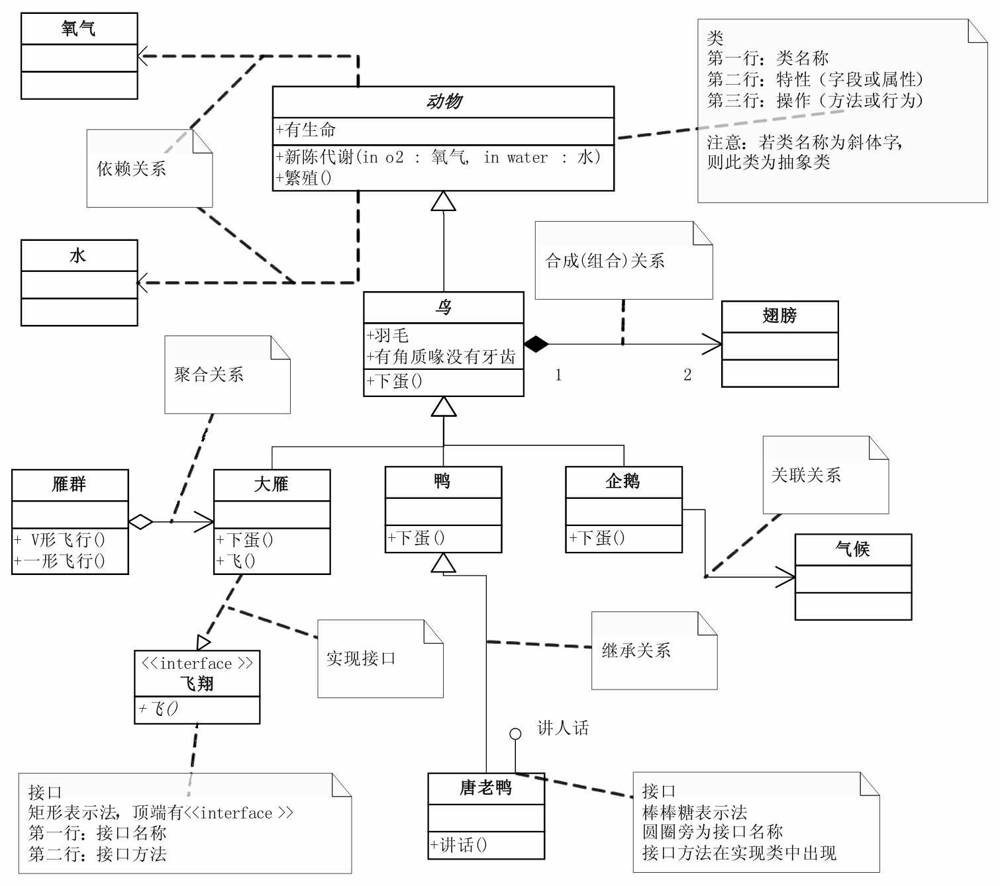
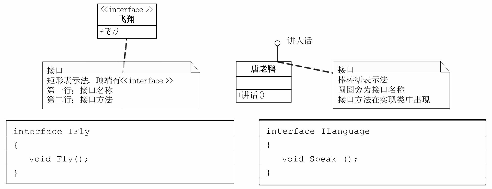
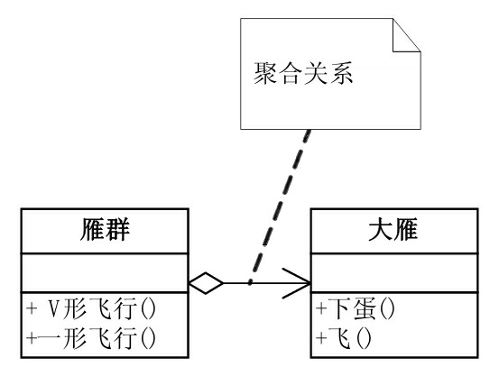
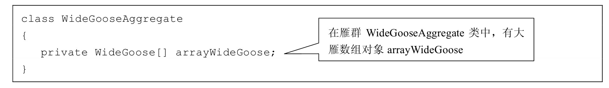
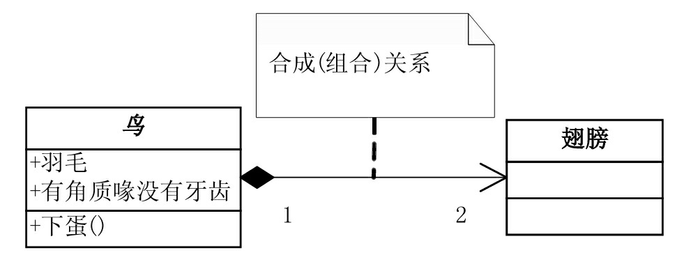
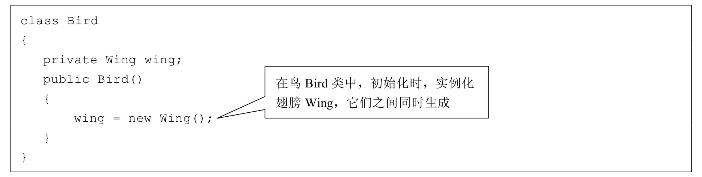
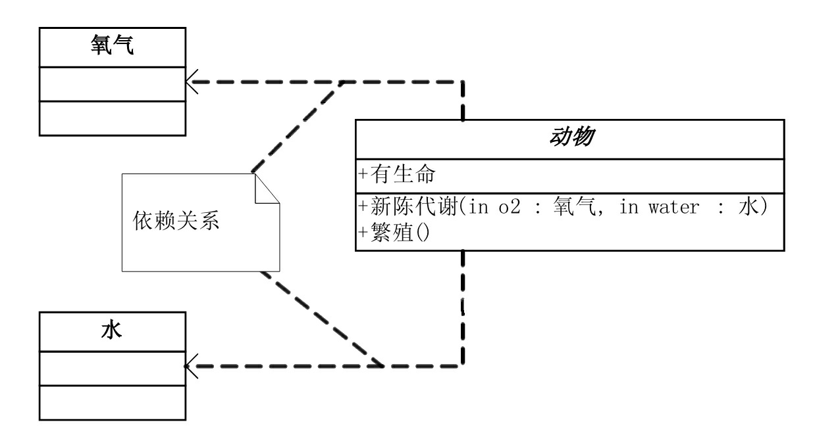
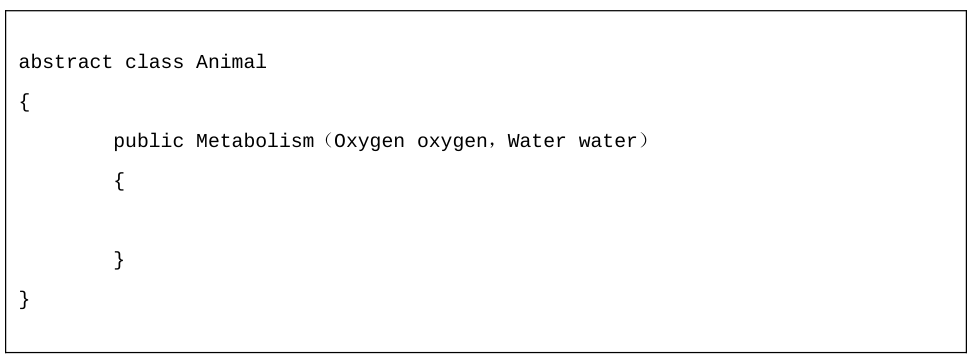

# 设计图
## UML 
UML（统一建模语言）是一种标准的图形化建模语言，用于软件设计和系统建模。它提供了一套符号和语法，用于描述系统的结构、行为和交互。

### 访问权限的表示
访问权限是指在UML图中对元素的可见性和访问级别进行控制。常见的访问权限包括：
| 修饰符 | 符号 | 说明         |
|--------|------|--------------|
| public | +    | 公有         |
| protected | # | 受保护       |
| private | -   | 私有         |
| package | ~   | 包可见（默认）|

### 关系在代码中的表示
#### 接口

#### 聚合

#### 组合

#### 依赖

