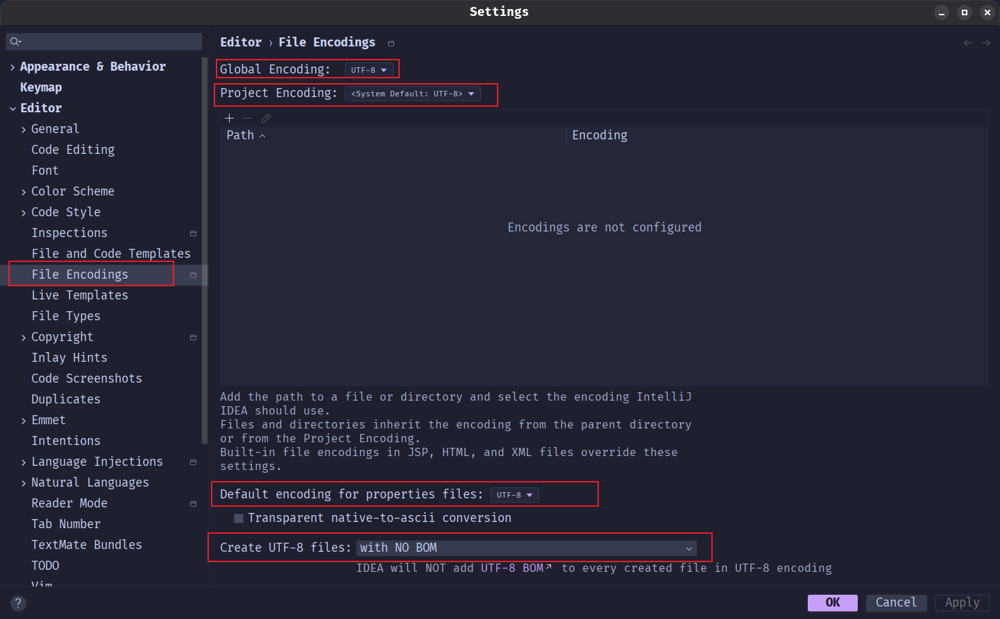

# IDEA

## 文件编码

在开发过程中, 如果文件编码不一致, 可能会导致中文乱码问题, 所以建议统一设置为 UTF-8.

1. 打开 File -> Settings -> Editor -> File Encodings, 按照下图进行设置:

> [!NOTE]
> 这里配置的编码方式是IDEA 用来读取和保存文件时采用的字符编码方式, 如果需要打开的文件本身并不是当前指定的UTF-8编码, 那么打开这个文件可能会出现乱码

## 配置本地Mavne

IDEA 中内置了 Maven, 但是有时候我们需要使用自己本地的 Maven 可以按照如下步骤进行配置:

1. 打开 File -> Settings
2. 选择 Build, Execution, Deployment -> Build Tools -> Maven
3. 修改图示中的 Maven配置:

4. 上面的设置仅对当前项目生效, 如果需要之后创建的新项目都生效, 还需要在新创项目设置中在按照上面的步骤进行配置一遍

## 查看栈帧

DEBUG 模式下，可以查看每个线程的栈帧信息，帮助调试程序. 信息展示如图:

## 配置Java程序启动参数

1. 打开 Run -> Edit Configurations

2. 按照下图操作:

