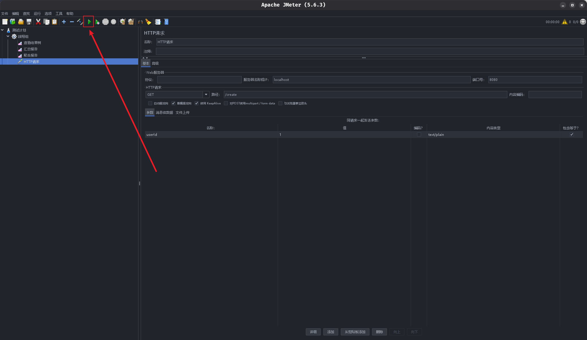

# Jmeter

## 配置语言

Jmeter的语言默认设置是英文, 可以通过语言选择选项更改, 但每次重新启动的时仍然会恢复默认语言, 每次使用都需要重新手动选择语言十分麻烦，这里提供一种永久更改Jmeter语言的方法。

1. 找到Jemter安装目录, 打开`bin`文件夹
2. 使用文本编辑器打开`jmeter.properties`文件
3. 找到图示中的行, 将起值改为`zh_CN`

## 并发测试

多线程并发测试可以按照如下步骤进行:

1. 在"测试计划"中添加一个"线程组"
2. 在线程组中设置线程数(用户数), Ramp-Up时间(启动所有线程的总时间), 循环次数(每个线程执行的次数)
3. 在线程组中添加HTTP请求, 设置请求的URL等信息
4. 在线程组中添加监听器: "查看结果树", "聚合报告", "汇总报告", 按照上面的步骤配置完成后:

5. 保存测试计划, 点击运行按钮开始

