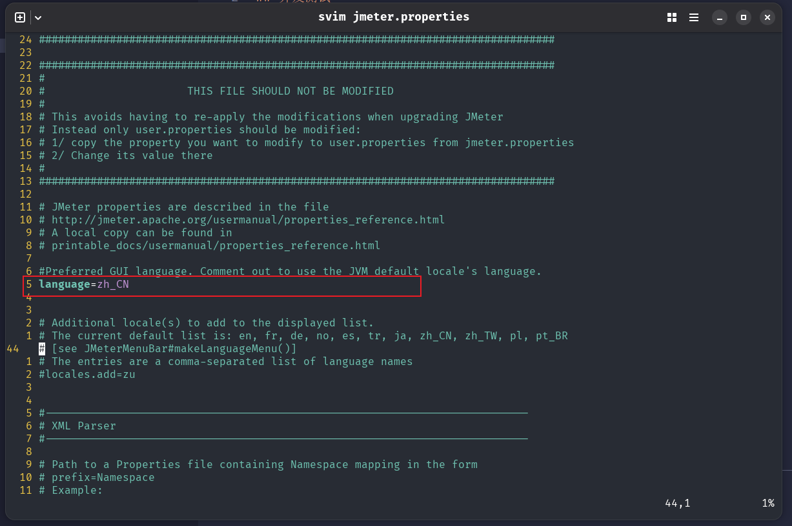
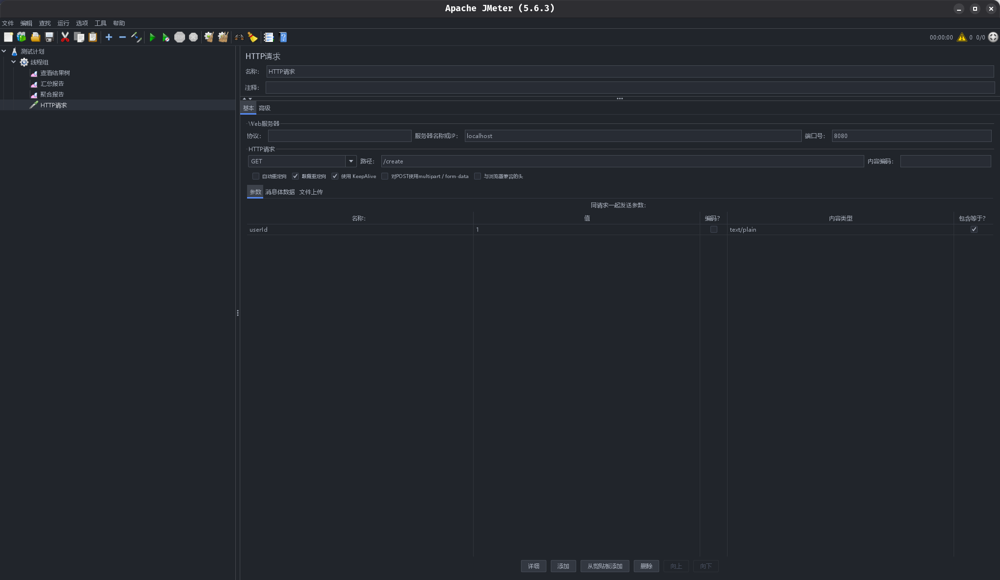

# Jmeter

## 配置UI语言

Jmeter的语言默认设置是英文, 可以通过语言选择选项更改, 但每次重新启动的时仍然会恢复默认语言, 每次使用都需要重新手动选择语言十分麻烦，这里提供一种永久更改Jmeter语言的方法。

1. 找到Jemter安装目录, 打开`bin`文件夹
2. 使用文本编辑器打开`jmeter.properties`文件
3. 找到图示中的行, 将起值改为`zh_CN`

## 并发测试

多线程并发测试可以按照如下步骤进行:

1. 在"测试计划"中添加一个"线程组", 然后填写相关设置. 部分参考解释:
    + Ramp-Up时间(秒): 执行全部线程的时间.
        + 当线程数设置太多, Ramp-Up时间设置又很短时, 有可能无法执行完所有线程.
        + 当线程数设置很少, Ramp-Up时间设置又很长时, 不会提前结束, 而是到达设定Ramp-up时间才会结束, 此时每秒启动的线程数可能少
    + 循环次数: 当前线程组组, 执行的次数, 假设线程数为5, 循环次数为10, 则总请求数为50次
3. 在线程组中添加HTTP请求, 设置请求的URL等信息
4. 在线程组中添加监听器: "查看结果树", "聚合报告", "汇总报告", 按照上面的步骤配置完成后:

5. 保存测试计划, 点击运行按钮开始

## 设置请求体或请求参数

在HTTP请求中, 图示位置添加请求体或请求参数的内容. 

对于**支持请球体的请求方法**这里设置的是**请求体内容**, 对于**不支持请求体的请求方法**这里设置的是**请求参数**.

## 设置请求头

1. 在HTTP请求下, 添加一个"HTTP信息头管理器"

2. 在HTTP信息头管理器中, 添加需要设置的请求头和对应的值

## 从CSV文件读取参数值

1. 在测试计划或线程组下, 添加一个"CSV Data Set Config"

2. 填写 CSV Dataa Set Config 页面相关配置信息

3. 在其他地方使用`${变量名}`的方式读取CSV文件之中的变量值

