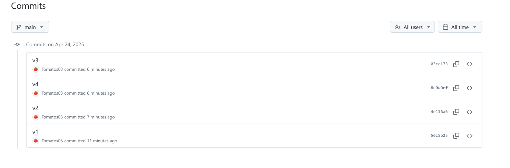
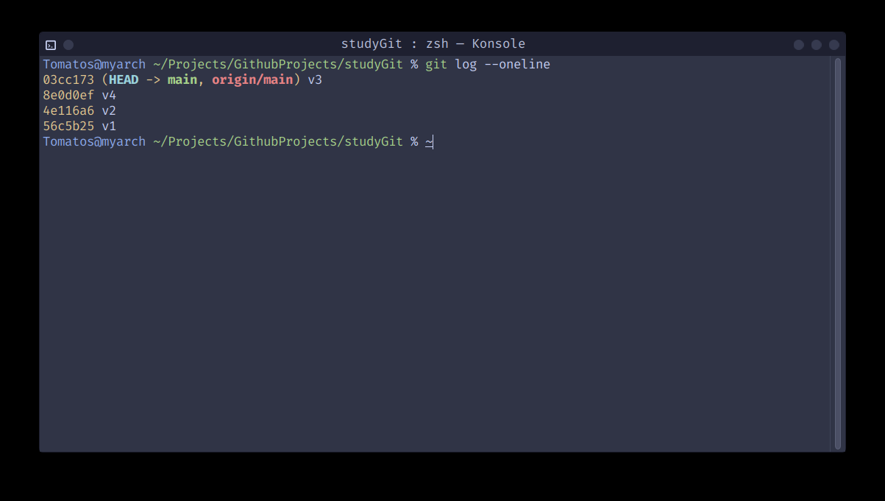

# Git

## 信息配置

### 用户信息的配置

```git
# 默认为局部配置
# 配置用户邮箱
git config user.email "Your Email"
# 配置用户名
git config user.name "Your Name"

# 配置默认编辑器
git config --global core.editor "vim"

# git 2.28+
# 配置初始化git仓库时默认分支
git config --global init.defaultBranch main

# 配置全局用户信息
git config --global user.name "Your Name"
git config --global user.email "Your Email"

```

### 查看所有 Git 配置

```git
# 查看所有配置
git config --list

# 查看当前仓库用户的用户名
git config --get user.name
# 查看当前仓库用户的邮箱
git config --get user.email


# 参数顺序任意
# 查看全局用户名
git config --global --get user.name
# 查看全局用户邮箱
git config --global --get user.email
```

## 基础操作

### 本地仓库

代码需要提交到暂存区才能提交到本地仓库

#### 初始化本地仓库

```git
git init
```

#### 添加文件到暂存区

```git
# 提交单个文件
git add <file-name>

# 提交所有文件
git add .

# 提交指定目录下的所有文件
git add <dir-name>
```

#### 修改本地仓库中的提交

```git
# 使用交互式变基，修改最近n条提交
git rebase -i HEAD~n
```

**注:** 交互式变基会改变提交历史 hash

##### 交互命令参考

| 命令     | 意义                                               | 典型用途                             |
| :------- | :------------------------------------------------- | :----------------------------------- |
| `pick`   | 保持这个提交，不做改动                             | 大部分提交直接保留                   |
| `reword` | 保持提交内容，但**修改提交信息**                   | 改错别字、优化提交说明               |
| `edit`   | 停下来，**修改提交内容或者信息**                   | 发现代码有小错误，想补救             |
| `squash` | 将本提交**和上一个提交合并**，并编辑提交信息       | 多个小提交，想打包成一个             |
| `fixup`  | 将本提交**合并到上一个提交**，但**忽略本提交信息** | 修修补补的小提交，直接塞进上一个提交 |
| `drop`   | **丢弃这个提交**                                   | 提交错了，想干脆删掉                 |

#### 暂存区的变动提交到本地仓库

```git
# 提交代码到暂存区, 并使用指定的默认编辑器编写提交信息
# 无提交信息视为取消本次提交
git commit

# 添加参数m显示指定提交信息
git commit -m "commit message"

# 修改最近一次提交信息
git commit --amend -m "new commit message"
```

### 远程仓库

#### 克隆远程仓库

```git
# 克隆远程仓库
git clone <remote-repo-url>
```

#### 查看远程仓库

```git
# 查看远程仓库
git remote -v
```

#### 关联远程仓库

关联远程仓库后，下一次可以直接使用 `git push` 提交代码到远程仓库

```git
git push --set-upstream origin main

# 简化命令
git push -u origin main
```

### 日志

#### 查看提交日志

```git
git log

# 查看简洁的提交日志
git log --oneline

# 查看简洁的提交日志，包含分支信息
git log --oneline --graph
```

### 分支

#### 查看所有分支、 所处分支

```git
git branch

```

#### 重命名分支

```git
# 不提供old-branch-name参数时，默认重命名当前分支
git branch -m [<old-branch-name>] <new-branch-name>
```

#### 创建分支

```git
git branch <branch-name>
```

#### 拉取远程分支

```git
git fetch origin <branch-name>
```

#### 合并分支

```git
git merge <branch-name>
```

#### 拉取并合并分支

```git
# 拉取远程分支合并到当前分支
# 没有追踪远程仓库
git pull <remote-repo-name> <branch-name>

# 有追踪远程仓库
git pull

```

#### 切换分支

```git
# 切换到指定分支(分支必须存在)
git checkout <branch-name>
# 切换到指定分支(分支必须不存在)
git checkout -b <branch-name>

# git 2.23 版本后推荐使用

# 切换到指定分支(分支必须存在)
git switch <branch-name>
# 切换到指定分支(分支必须不存在)
git switch -c <branch-name>
```

#### 删除分支

```git
# 删除分支
git branch -d <branch-name>
```

#### 变基

变基操作会将当前分支的提交记录移动到指定分支的最新提交之后

```git
# 1. 开发前先同步主分支
git checkout main
git pull origin main

# 2. 变基当前分支
git checkout feature
git rebase main

# 变基前
A --- B --- C (main)
         \
          D --- E (feature)

# 变基后
A --- B --- C (main)
             \
              D' --- E' (feature)

```

## 个人开发

### 分支调整

现在有如下需求，将分支 v4 调整到分支 v3 之后



#### 操作步骤

1. 查看分支日志，找对提交记录 v2 对应的 hash 值



2. 基于提交点 v2 创建并切换到新分支

```git
git switch -c new-dev 4e116a6
```

3. 挑选其他分支点

```
git cheery-pick <branch-hash>
```

4. 切换回主分支

```git
git switch main
```

5. 硬重置主分支到新分支最新提交

```git
git reset --hard new-dev
```

6. 强制推送到远程分支

```git
git push -f origin main
```
