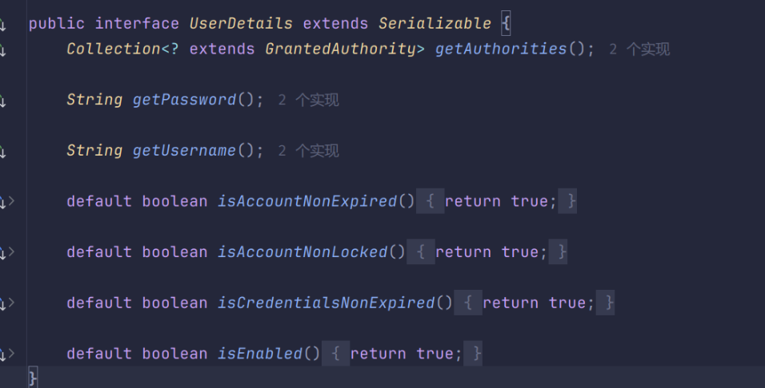

# Spring Security

Spring Security 基于 Servelet 提供的 Filter 接口。在 Spring Security 之中有许多 Filter，这些 Filter 实现了用户权限认证和授权等，这些 Filter 组成了一个 FilterChain,下面的图片展示了 Spring Security 提供了具体 Filter 以及顺序，

## 接口

### Authentication

该接口定义了一些用户认证相关方法，详细含义如下表格
| 方法 | 类型 | 说明 |
|--------------------------|--------------------------------------|------|
| `getPrincipal()` | `Object` | **身份信息**（用户名或 `UserDetails` 对象） |
| `getCredentials()` | `Object` | **凭据信息**，如密码、验证码、token（认证后一般会被清除） |
| `getAuthorities()` | `Collection<? extends GrantedAuthority>` | **权限信息**，例如 `ROLE_USER`，`ROLE_ADMIN` |
| `getDetails()` | `Object` | 认证时的额外信息（如 IP、Session ID） |
| `isAuthenticated()` | `boolean` | 是否已认证通过 |
| `setAuthenticated()` | `void` | 设置认证状态，一般框架内部使用 |

### AuthenticationManager

定义 Spring Security 的 Filter 如何执行 认证 的 API, API 之中定义了一个方法 authenticate ，用于验证传入的 authentication 是否有效

#### 接口实现类

##### ProviderManager

这个实现类，内置了一个 `List<AuthenticationProvider>`实例，在进行认证的时候调用列表之中的`AuthenticationProvider`实现类进行实际的认证

### AuthenticationProvider

定义具体的凭证认证方式

### AuthenticationEntryPoint

定义如何处理认证失败或者没有提供凭证的 API

### AbstractAuthenticationProcessingFilter

用作验证用户凭证的基础`Filter`

### UserDetails

这个接口定义的用户的基本信息(密码、账户、权限)，提供了一组用户状态相关的接口

