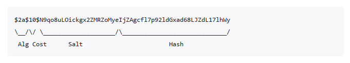

# 算法

## Hash 算法

### Bcrypt
bcrypt 是一种基于 Blowfish 加密算法的哈希函数，常用于密码存储。它通过引入“加盐”（salt）和可配置的计算成本（cost factor），有效防止彩虹表攻击和暴力破解。

**特点：**
- 每次加密都会生成不同的哈希值（即使明文相同），因为每次都会生成新的 salt。
- 计算成本可调，随着硬件性能提升可以增加 cost，提升破解难度。
- 广泛应用于 Web 应用的用户密码安全存储。

**流程:**

用户注册：明文密码 + 随机 salt → 哈希 → 存储（哈希值包含 salt） \
用户登录：输入密码 + 提取的 salt → 哈希 → 比较哈希值

> [!TIP]
> 使用的salt和cost factor相同, 得到的hash必然相同

**结构:**

> [!TIP]
> bcrypt 适合存储用户密码，不适合用于加密大量数据。