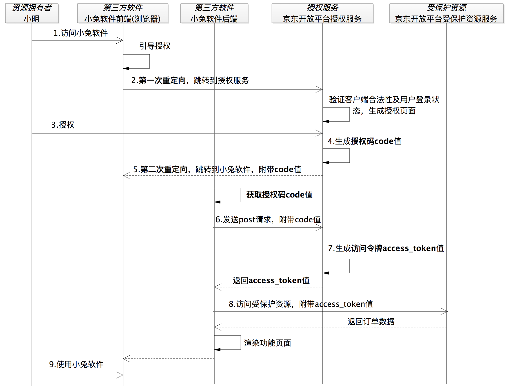

# OAuth

OAuth是Open Authorization的简写。 OAuth协议为用户资源的授权提供了一个安全的、开放而又简易的标准。与以往的授权方式不同之处是OAuth的授权不会使第三方触及到用户的帐号信息（如用户名与密码），即第三方无需使用用户的用户名与 密码就可以申请获得该用户资源的授权，因此OAuth是安全的

## OAuth 2.0

### 授权方式

OAuth2.0定义了四种授权模式，分别是授权码模式、简化模式、密码模式和客户端模式。

#### 授权码模式

工作流程:

适用场景: 

授权码模式是OAuth2中最安全最完善的一种模式，应用场景最广泛，可以实现服务之间的调用，常见的微信，QQ等第三方登录也可采用这种方式实现。

> **为什么要使用授权码, 而不是直接返回Access Token给客户端后台服务器?** \
> 答: 在第三方应用授权成功后, 需要跳转回到客户端的前端(利用请求时提供的回调地址), 如果此时第三方应用授权服务器提供的Access Token直接返回到客户端后台服务器, 授权之后用户就会一直卡在授权页面, 无法返回客户端. 所以需要对用户进行二次重定向让用户回到客户端前端, 并且不能够暴露敏感信息在前端, 使用授权码能够很好的解决这个问题

> [!NOTE]
> 授权码即使泄露也不会有安全问题, 因为授权码是一次性的, 只能使用一次, 且授权码的有效期很短(通常为几分钟), 过期后就无法使用了. 另外, 第三方授权服务器会预先配置好能够授权的回调地址(客户端服务地址), 如果授权码被恶意使用, 也会因为回调地址不匹配而无法获取Access Token

#### 简化模式

对授权模式的简化，不使用授权码, 而是直接返回Access Token给客户端前端。

适用场景: 
适用于没有服务器但客户端安全的情况。比如：纯手机小程序，JavaScript语言实现的网页插件等。

#### 密码模式

工作流程:
+ 第一步：直接告诉【A服务客户端】自己的【B服务认证服务】的用户名和密码 
+ 第二步：【A服务客户端】携带【B服务认证服务】的用户名和密码向【B服务认证服务】发起请求获取token。 
+ 第三步：【B服务认证服务】给【A服务客户端】颁发token。 

适用场景: 
此种模式虽然简单，但用户将B服务的用户名和密码暴露给A服务，需要两个服务信任度很高才能使用。 

#### 客户端模式

工作流程:
+ 第一步：A服务向B服务索取token。 
+ 第二步：B服务返回token给A服务。 

适用场景:
A服务本身需要B服务资源，与用户无关。