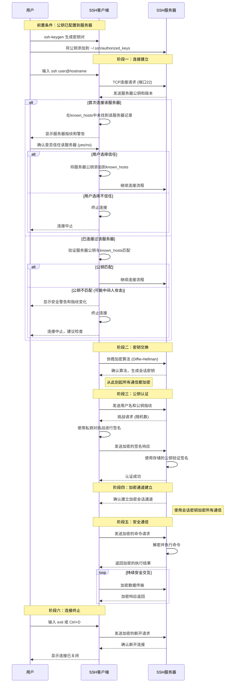

# SSH

SSH (Secure Shell) 是一种网络协议，用于在不安全的网络中安全地访问远程计算机。它通过加密技术确保通信的机密性和完整性。

## 工作流程
这里仅介绍最常见的基于公钥和私钥的 SSH 连接流程：

## 身份验证方式

SSH 通常使用以下方式进行身份验证：

1. **公钥和私钥**: 通过生成密钥对，确保只有拥有私钥的用户可以访问。
2. **用户名和密码**: 提供传统的验证方式，但安全性较低。

SSH 是管理远程服务器和保护网络通信的关键工具，广泛应用于开发、运维和网络管理领域。

## 公钥和私钥

公钥和私钥是非对称加密中的一对密钥，用于确保数据的安全性和完整性

1. **公钥**: 可以公开分发的密钥，用于加密数据或验证数字签名。
2. **私钥**: 必须保密的密钥，用于解密数据或生成数字签名。

常见用途:
1. 私钥对需要发送的消息进行数字签名, 公钥对签名进行验证, 能够确保消息的完整性和真实性, 但不保证消息不被窃听
2. 公钥对消息进行加密, 私钥对加密的消息进行解密, 能够确保消息的机密性, 但不保证消息的完整性和和真实性(因为公钥是公开的)

安全通信流程如下：
1. **发送方用接收方公钥加密消息**（保证只有接收方能解密，防窃取）。
2. **发送方用自己的私钥对消息签名**（保证消息确实来自发送方，防篡改）。
3. **接收方收到消息后：**
   - 用自己的私钥解密（获得明文）。
   - 用发送方公钥验证签名（确认来源和完整性）。
