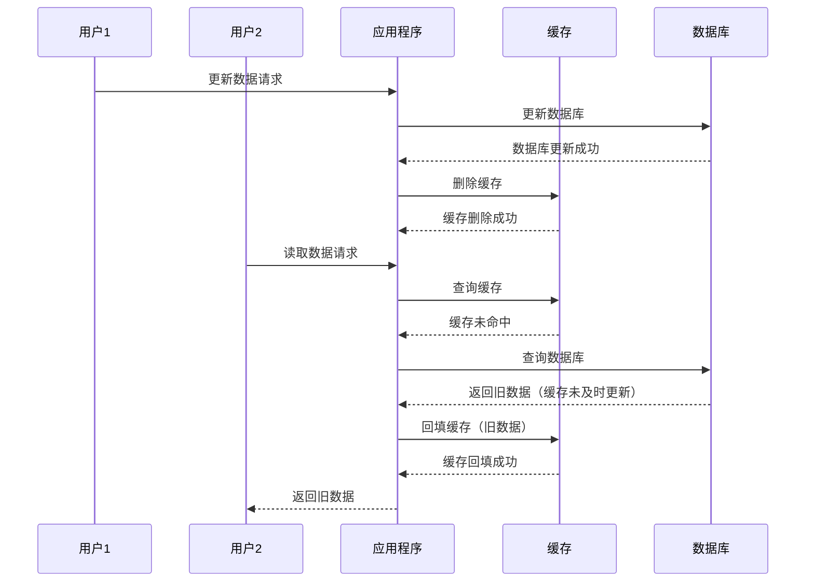

# Java

## Java 基本数据类型

| 数据类型 | 最小值                  | 最大值                 | 占用字节数 |
| -------- | ----------------------- | ---------------------- | ---------- |
| byte     | -2<sup>7</sup>          | 2<sup>7</sup> - 1      | 1          |
| short    | -2<sup>15</sup>         | 2<sup>15</sup> - 1     | 2          |
| int      | -2<sup>31</sup>         | 2<sup>31</sup> - 1     | 4          |
| long     | -2<sup>63</sup>         | 2<sup>63</sup> - 1     | 8          |
| float    | -3.4 × 10<sup>38</sup>  | 3.4 × 10<sup>38</sup>  | 4          |
| double   | -1.7 × 10<sup>308</sup> | 1.7 × 10<sup>308</sup> | 8          |
| char     | 0                       | 2<sup>16</sup> - 1     | 2          |
| boolean  | false                   | true                   | 1 (理论上) |

## Java 变量初始值

> [!NOTE]
> 只有类的成员变量（字段）才会有默认初始值。局部变量不会被自动初始化，必须显式赋值后才能使用。

| 数据类型 | 默认值   |
| -------- | -------- |
| byte     | 0        |
| short    | 0        |
| int      | 0        |
| long     | 0L       |
| float    | 0.0f     |
| double   | 0.0d     |
| char     | '\u0000' |
| boolean  | false    |
| 引用类型 | null     |

## Java 修饰符

Java 提供了多种修饰符，用于控制类、方法、变量等的访问权限和行为。修饰符分为两大类：访问控制修饰符和非访问控制修饰符。

### 访问控制修饰符

| 修饰符           | 类内部 | 同一包 | 子类 | 其他包 |
| ---------------- | ------ | ------ | ---- | ------ |
| `public`         | 是     | 是     | 是   | 是     |
| `protected`      | 是     | 是     | 是   | 否     |
| 默认（无修饰符） | 是     | 是     | 否   | 否     |
| `private`        | 是     | 否     | 否   | 否     |

-   **`public`**：对所有类可见。
-   **`protected`**：对同一包和子类可见。
-   **默认（无修饰符）**：仅对同一包内的类可见。
-   **`private`**：仅对类内部可见。

### 非访问控制修饰符

#### 类修饰符

-   **`abstract`**：声明一个抽象类，不能直接实例化。
-   **`final`**：声明一个类不能被继承。
-   **`strictfp`**：限制浮点运算的精度和舍入行为。

#### 方法修饰符

-   **`abstract`**：声明一个抽象方法，必须在子类中实现。
-   **`final`**：方法不能被子类重写。
-   **`static`**：方法属于类而不是实例。
-   **`synchronized`**：方法在多线程环境下同步执行。
-   **`native`**：方法由本地代码实现（非 Java 实现）。
-   **`strictfp`**：限制浮点运算的精度和舍入行为。

##### synchronized

`synchronized` 确保多个线程在并发访问共享资源时，能够以互斥的方式执行(**同一个时刻只能有一个线程访问到资源**)，从而避免数据竞争和不一致的问题。

###### 线程竞争

下面的示例会出现线程竞争问题，导致预期结果不一定是 0

> [!NOTE]
> 一个线程刚刚修改了变量的值，但还没有写回内存，另一个线程就读取了旧值并进行了修改,最终，后一个线程的修改会覆盖前一个线程的修改，导致最后结果的出错。

```java
class BankAccount {
    private int balance;
    public int getBalance() {
        return balance;
    }

    public void deposit(int amount) {
        this.balance += amount;
    }

    public void withdraw(int amount) {
        this.balance -= amount;
    }
}
```

```java
public class Main {
    public static void main(String[] args) {
        BankAccount bankAccount = new BankAccount();
        // 创建第一个线程
        Thread thread0 = new Thread(() -> {
            for (int i = 0; i < 1000; ++i) {
                System.out.println(Thread.currentThread().getName());
                bankAccount.deposit(1);
            }
            System.out.println("thread0 completed");
        });
        // 第二个线程
        Thread thread1 = new Thread(() -> {
            for (int i = 0; i < 1000; i++) {
                System.out.println(Thread.currentThread().getName());
                bankAccount.withdraw(1);
            }
            System.out.println("thread1 completed");
        });
        // 启动线程
        thread0.start();
        thread1.start();

        try {
            // 等待thread1、thread0执行完成
            thread1.join();
            thread0.join();
        } catch (InterruptedException e) {
            e.printStackTrace();
        }

        System.out.println(bankAccount.getBalance());
    }
}
```

解决方法

```java
class BankAccount {
    private int balance;
    public int getBalance() {
        return balance;
    }

    public synchronized void deposit(int amount) {
        this.balance += amount;
    }

    public synchronized void withdraw(int amount) {
        this.balance -= amount;
    }
}
```

> [!NOTE]
>
> -   当 `synchronized` 关键字修饰实例方法时，锁对象是 `this`，即当前实例对象。
> -   当 `synchronized` 关键字修饰静态方法时，锁对象是当前类的 `Class` 对象。

#### 变量修饰符

-   **`final`**：变量的值一旦初始化后不能更改。
-   **`static`**：变量属于类而不是实例。
-   **`transient`**：变量不会被序列化。
-   **`volatile`**：变量在多线程环境下保持可见性。

## Java 类加载顺序

在 Java 中，类的加载顺序是由 JVM 在运行时动态决定的。类加载的顺序直接影响类的初始化和静态块的执行顺序。

### 加载顺序

以下是类加载的顺序，使用箭头图示说明：

```plaintext
父类静态代码块和静态变量
    ↓
子类静态代码块和静态变量
    ↓
父类实例变量和初始化块
    ↓
父类构造方法
    ↓
子类实例变量和初始化块
    ↓
子类构造方法
```

> [!TIP]
> 静态成员变量和静态代码块的初始化顺序是“谁写在前面谁先执行”

```java
class Parent {
     static {
          System.out.println("父类静态代码块");
     }

     {
          System.out.println("父类实例初始化块");
     }

     public Parent() {
          System.out.println("父类构造方法");
     }
}

class Child extends Parent {
     static {
          System.out.println("子类静态代码块");
     }

     {
          System.out.println("子类实例初始化块");
     }

     public Child() {
          System.out.println("子类构造方法");
     }
}

public class Main {
     public static void main(String[] args) {
          System.out.println("创建第一个子类对象：");
          new Child();

          System.out.println("\n创建第二个子类对象：");
          new Child();
     }
}
```

输出结果:

```text
    父类静态代码块
    子类静态代码块

    创建第一个子类对象时：

    父类实例初始化块
    父类构造方法
    子类实例初始化块
    子类构造方法

    创建第二个子类对象时：

    父类实例初始化块
    父类构造方法
    子类实例初始化块
    子类构造方法
```

> [!TIP]
> 静态代码块的执行顺序与类的加载顺序一致，而实例初始化块和构造方法的执行顺序与对象的创建顺序一致。

## Java 泛型

Java 泛型（Generics）是 Java 5 引入的一种特性，用于在编译时提供类型检查和消除类型转换的需要。它允许类、接口和方法操作指定类型的对象。

### 泛型类

泛型类允许在类定义时指定类型参数。

```java
// <T>表示声明一个泛型类
// <T>必须在类名后书写
public class Box<T> {
    private T item;

    public void setItem(T item) {
        this.item = item;
    }

    public T getItem() {
        return item;
    }
}

// 使用泛型类
Box<String> stringBox = new Box<>();
stringBox.setItem("Hello");
```

### 泛型方法

泛型方法允许在方法定义时指定类型参数。

```java
public class Utils {
    // <T>表示声明一个泛型方法
    // <T>必须在方法返回值前书写
    public static <T> void printArray(T[] array) {
        for (T element : array) {
            System.out.println(element);
        }
    }
}

// 使用泛型方法
String[] names = {"Alice", "Bob", "Charlie"};
Utils.printArray(names);
```

> [!TIP]
> 如果方法和类都使用了泛型，且方法的泛型参数与类的泛型参数同名，方法的泛型参数会覆盖类的泛型参数。

### 通配符

通配符 `?` 用于表示未知类型，常用于泛型的上下界约束。

-   **无界通配符**：`<?>` 表示任意类型。
-   **上界通配符**：`<? extends T>` 表示 T 或 T 的子类。
-   **下界通配符**：`<? super T>` 表示 T 或 T 的父类。

```java
public void printList(List<?> list) {
    for (Object item : list) {
        System.out.println(item);
    }
}
```

### 泛型的局限性

1. **类型擦除**：泛型在运行时会被擦除，导致类型信息不可用。
2. **不能使用基本类型**：泛型不支持基本数据类型（如 `int`），需要使用包装类（如 `Integer`）。
3. **不能创建泛型数组**：例如，`new T[10]` 是非法的。

## Java 接口

### 成员变量

接口中的字段默认是 `public static final`，即常量，不能被修改。

> [!NOTE]
> 由于成员变量默认是常量，所以在接口中定义的变量必须初始化。

```java
public interface Example {
    // 下面两种写法是等价的
    int VALUE = 10;
    public static final int VALUE2 = 20;
}
```

### 成员方法

接口中的方法默认是 `public abstract`，即抽象方法。

-   Java 8 之前，接口方法只能是 `public abstract`。
-   Java 8 引入了默认方法（`default`）和静态方法（`static`）。
-   Java 9 开始支持私有方法（`private`），用于辅助默认方法或静态方法。

> [!NOTE]
> 接口中的方法不能有方法体，除非是默认方法或静态方法。其中默认方法还可以被实现类重写。

### 多继承冲突

如果一个类实现了多个接口，且这些接口中有相同签名的默认方法，必须在实现类中重写该方法以解决冲突。

```java
public interface A {
    default void method() {
        System.out.println("A");
    }
}

public interface B {
    default void method() {
        System.out.println("B");
    }
}

public class C implements A, B {
    @Override
    public void method() {
        A.super.method(); // 或 B.super.method()
    }
}
```

### 修饰符

在 Java 中，接口可以使用以下修饰符：

1. **访问修饰符**：

    - `public`：接口可以被任何类访问。
    - 默认（无修饰符）：接口仅限于同一包内访问。

2. **其他修饰符**：
    - `abstract`：接口默认是抽象的，即使不显式声明。
    - `strictfp`：用于限制浮点计算的精度和舍入行为，使其符合 IEEE 754 标准。

> [!NOTE]
> 接口类不能使用 `final` 修饰，因为接口本质上是用来被实现的。

## Java 核心机制

### 动态绑定与静态绑定

| 特性     | 动态绑定               | 静态绑定                                           |
| -------- | ---------------------- | -------------------------------------------------- |
| 定义     | 在运行时确定调用的方法 | 在编译时确定调用的方法                             |
| 时机     | 运行时                 | 编译时                                             |
| 应用     | 方法覆盖(override)     | 方法重载(overload)、私有方法、静态方法、final 方法 |
| 关键字   | 无需特殊关键字         | static、private、final                             |
| 效率     | 相对较低               | 相对较高                                           |
| 多态性   | 支持                   | 不支持                                             |
| 实现方式 | 通过虚方法表           | 直接调用                                           |
| 示例     | 子类重写父类方法       | 构造方法、静态方法调用                             |

### 泛型擦拭

Java 编译器在编译泛型代码时，会移除所有泛型类型参数 ，并将它们替换为：

-   如果有上界（如 `<T extends Number>`），则替换为上界类型（如 Number）；
-   如果没有上界（如 `<T>`），则替换为 Object。

泛型擦拭机制主要做到以下三件事情：

1. **类型参数替换** - 将泛型类型参数替换为原始类型（擦除类型变量，替换为界限类型或 Object）
2. **类型转换插入** - 在必要的位置自动插入类型转换代码，保证类型安全

3. **桥接方法生成** - 创建桥接方法以保持多态性，解决方法签名不一致的问题

这些实现方式保证了 Java 泛型的向后兼容性，但也带来了类型信息在运行时不可用等局限性。

> [!NOTE]
> 对于不同泛型参数的类得到的 class 对象相同

## Java 线程

### 创建线程

在 Java 中，创建线程主要有两种方式：

1.  继承 `Thread` 类：

```java
// 1. 定义一个类，继承 Thread 类
class MyThread extends Thread {
    // 2. 重写 run() 方法，编写线程执行的任务
    @Override
    public void run() {
        // 线程要执行的任务
        System.out.println("线程正在执行：" + Thread.currentThread().getName());
    }
}

public class Main {
    public static void main(String[] args) {
        // 3. 创建线程对象
        MyThread thread1 = new MyThread();
        // 4. 启动线程
        thread1.start(); // 启动线程，执行 run() 方法

        MyThread thread2 = new MyThread();
        thread2.start();
    }
}
```

2.  实现 `Runnable` 接口：

```java
// 1. 定义一个类，实现 Runnable 接口
class MyRunnable implements Runnable {
    // 2. 实现 run() 方法，编写线程执行的任务
    @Override
    public void run() {
        // 线程要执行的任务
        System.out.println("线程正在执行：" + Thread.currentThread().getName());
    }
}

public class Main {
    public static void main(String[] args) {
        // 3. 创建 Runnable 对象
        MyRunnable runnable = new MyRunnable();
        // 4. 创建 Thread 对象，并将 Runnable 对象作为参数传递
        Thread thread1 = new Thread(runnable);
        // 5. 启动线程
        thread1.start(); // 启动线程，执行 run() 方法
        // 实际上由thread 代理执行runnable的run方法

        Thread thread2 = new Thread(runnable);
        thread2.start();
    }
}
```

> [!TIP]
> 实现 `Runnable` 接口的方式更为常用，因为它避免了 Java 单继承的限制，并且更符合面向接口编程的思想。

### 线程状态

Java 线程有以下几种状态：

| 状态              | 描述                                                             |
| ----------------- | ---------------------------------------------------------------- |
| **NEW**           | 初始状态，线程被创建但还未启动。                                 |
| **RUNNABLE**      | 可运行状态，包括 `READY`（就绪）和 `RUNNING`（运行中）两种状态。 |
| **BLOCKED**       | 阻塞状态，线程等待锁释放。                                       |
| **WAITING**       | 等待状态，线程等待其他线程的通知。                               |
| **TIMED_WAITING** | 定时等待状态，线程在指定时间内等待其他线程的通知。               |
| **TERMINATED**    | 终止状态，线程执行完毕。                                         |

### 多线程常见问题

#### 缓存与数据库双写不一致问题

在分布式系统中，缓存与数据库的双写操作可能会导致数据不一致问题。常见的场景是：当数据库更新后，缓存未及时更新或删除需要一些时间，在这段时间里查询导致读取缓存时获取到的是旧数据，造成数据不一致

> [!NOTE]
> 问题产生的原因是两个操作之间的时间间隔内，其他线程读取了旧的缓存数据或缓存被其他线程覆盖，导致数据不一致



##### 解决方案

1. **缓存延迟双删策略**：

    - 更新数据库后，立即删除缓存。
    - 等待一段时间后，再次删除缓存，确保缓存中不会存在旧数据。

2. **消息队列异步更新**：

    - 数据库更新后，发送消息到消息队列。
    - 消费者监听消息队列，异步更新缓存。

3. **读写分离策略**：
    - 写操作直接更新数据库，并删除缓存。
    - 读操作优先从缓存读取，缓存未命中时从数据库读取并回填缓存。

> [!TIP]
> 选择合适的策略需要根据业务场景权衡一致性、性能和复杂性。

## Java 默认行为

### 字符串和其他对象加法运算

在 Java 中，使用 `+` 运算符进行字符串和其他对象的加法运算时，会自动调用对象的 `toString()` 方法将对象转换为字符串。

```java
public class Main {
    public static void main(String[] args) {
        A a = new A();
        System.out.println("Hello" + a); // 输出 HelloA{}
    }
}

class A {
    @Override
    public String toString() {
        return "A{}";
    }
}
```
