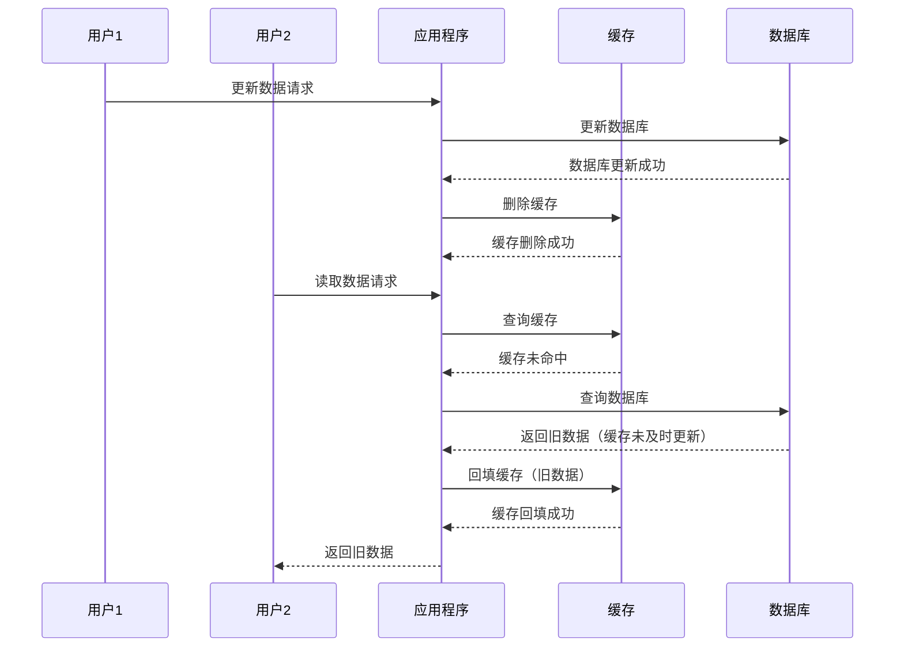
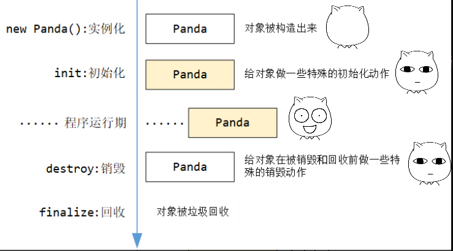

# Java

## Java 基本数据类型

| 数据类型 | 最小值                  | 最大值                 | 占用字节数 |
| -------- | ----------------------- | ---------------------- | ---------- |
| byte     | -2<sup>7</sup>          | 2<sup>7</sup> - 1      | 1          |
| short    | -2<sup>15</sup>         | 2<sup>15</sup> - 1     | 2          |
| int      | -2<sup>31</sup>         | 2<sup>31</sup> - 1     | 4          |
| long     | -2<sup>63</sup>         | 2<sup>63</sup> - 1     | 8          |
| float    | -3.4 × 10<sup>38</sup>  | 3.4 × 10<sup>38</sup>  | 4          |
| double   | -1.7 × 10<sup>308</sup> | 1.7 × 10<sup>308</sup> | 8          |
| char     | 0                       | 2<sup>16</sup> - 1     | 2          |
| boolean  | false                   | true                   | 1 (理论上) |

## Java 变量初始值

> [!NOTE]
> 只有类的成员变量（字段）才会有默认初始值。局部变量不会被自动初始化，必须显式赋值后才能使用。

| 数据类型 | 默认值   |
| -------- | -------- |
| byte     | 0        |
| short    | 0        |
| int      | 0        |
| long     | 0L       |
| float    | 0.0f     |
| double   | 0.0d     |
| char     | '\u0000' |
| boolean  | false    |
| 引用类型 | null     |

## Java 修饰符

Java 提供了多种修饰符，用于控制类、方法、变量等的访问权限和行为。修饰符分为两大类：访问控制修饰符和非访问控制修饰符。

### 访问控制修饰符

| 修饰符           | 类内部 | 同一包 | 子类 | 其他包 |
| ---------------- | ------ | ------ | ---- | ------ |
| `public`         | 是     | 是     | 是   | 是     |
| `protected`      | 是     | 是     | 是   | 否     |
| 默认（无修饰符） | 是     | 是     | 否   | 否     |
| `private`        | 是     | 否     | 否   | 否     |

-   **`public`**：对所有类可见。
-   **`protected`**：对同一包和子类可见。
-   **默认（无修饰符）**：仅对同一包内的类可见。
-   **`private`**：仅对类内部可见。

### 非访问控制修饰符

#### 类修饰符

-   **`abstract`**：声明一个抽象类，不能直接实例化。
-   **`final`**：声明一个类不能被继承。
-   **`strictfp`**：限制浮点运算的精度和舍入行为。

#### 方法修饰符

-   **`abstract`**：声明一个抽象方法，必须在子类中实现。
-   **`final`**：方法不能被子类重写。
-   **`static`**：方法属于类而不是实例。
-   **`synchronized`**：方法在多线程环境下同步执行。
-   **`native`**：方法由本地代码实现（非 Java 实现）。
-   **`strictfp`**：限制浮点运算的精度和舍入行为。

##### synchronized

`synchronized` 确保多个线程在并发访问共享资源时，能够以互斥的方式执行(**同一个时刻只能有一个线程访问到资源**)，从而避免数据竞争和不一致的问题。

###### 线程竞争

下面的示例会出现线程竞争问题，导致预期结果不一定是 0

> [!NOTE]
> 一个线程刚刚修改了变量的值，但还没有写回内存，另一个线程就读取了旧值并进行了修改,最终，后一个线程的修改会覆盖前一个线程的修改，导致最后结果的出错。

```java
class BankAccount {
    private int balance;
    public int getBalance() {
        return balance;
    }

    public void deposit(int amount) {
        this.balance += amount;
    }

    public void withdraw(int amount) {
        this.balance -= amount;
    }
}
```

```java
public class Main {
    public static void main(String[] args) {
        BankAccount bankAccount = new BankAccount();
        // 创建第一个线程
        Thread thread0 = new Thread(() -> {
            for (int i = 0; i < 1000; ++i) {
                System.out.println(Thread.currentThread().getName());
                bankAccount.deposit(1);
            }
            System.out.println("thread0 completed");
        });
        // 第二个线程
        Thread thread1 = new Thread(() -> {
            for (int i = 0; i < 1000; i++) {
                System.out.println(Thread.currentThread().getName());
                bankAccount.withdraw(1);
            }
            System.out.println("thread1 completed");
        });
        // 启动线程
        thread0.start();
        thread1.start();

        try {
            // 等待thread1、thread0执行完成
            thread1.join();
            thread0.join();
        } catch (InterruptedException e) {
            e.printStackTrace();
        }

        System.out.println(bankAccount.getBalance());
    }
}
```

解决方法

```java
class BankAccount {
    private int balance;
    public int getBalance() {
        return balance;
    }

    public synchronized void deposit(int amount) {
        this.balance += amount;
    }

    public synchronized void withdraw(int amount) {
        this.balance -= amount;
    }
}
```

> [!NOTE]
>
> -   当 `synchronized` 关键字修饰实例方法时，锁对象是 `this`，即当前实例对象。
> -   当 `synchronized` 关键字修饰静态方法时，锁对象是当前类的 `Class` 对象。

#### 变量修饰符

-   **`final`**：变量的值一旦初始化后不能更改。
-   **`static`**：变量属于类而不是实例。
-   **`transient`**：变量不会被序列化。
-   **`volatile`**：变量在多线程环境下保持可见性。

## Java 泛型

Java 泛型（Generics）是 Java 5 引入的一种特性，用于在编译时提供类型检查和消除类型转换的需要。它允许类、接口和方法操作指定类型的对象。

### 泛型类

泛型类允许在类定义时指定类型参数。

```java
// <T>表示声明一个泛型类
// <T>必须在类名后书写
public class Box<T> {
    private T item;

    public void setItem(T item) {
        this.item = item;
    }

    public T getItem() {
        return item;
    }
}

// 使用泛型类
Box<String> stringBox = new Box<>();
stringBox.setItem("Hello");
```

### 泛型方法

泛型方法允许在方法定义时指定类型参数。

```java
public class Utils {
    // <T>表示声明一个泛型方法
    // <T>必须在方法返回值前书写
    public static <T> void printArray(T[] array) {
        for (T element : array) {
            System.out.println(element);
        }
    }
}

// 使用泛型方法
String[] names = {"Alice", "Bob", "Charlie"};
Utils.printArray(names);
```

> [!TIP]
> 如果方法和类都使用了泛型，且方法的泛型参数与类的泛型参数同名，方法的泛型参数会覆盖类的泛型参数。

### 通配符

通配符 `?` 用于表示未知类型，常用于泛型的上下界约束。

-   **无界通配符**：`<?>` 表示任意类型。
-   **上界通配符**：`<? extends T>` 表示 T 或 T 的子类。
-   **下界通配符**：`<? super T>` 表示 T 或 T 的父类。

```java
public void printList(List<?> list) {
    for (Object item : list) {
        System.out.println(item);
    }
}
```

### 泛型的局限性

1. **类型擦除**：泛型在运行时会被擦除，导致类型信息不可用。
2. **不能使用基本类型**：泛型不支持基本数据类型（如 `int`），需要使用包装类（如 `Integer`）。
3. **不能创建泛型数组**：例如，`new T[10]` 是非法的。

## Java 接口

### 成员变量

接口中的字段默认是 `public static final`，即常量，不能被修改。

> [!NOTE]
> 由于成员变量默认是常量，所以在接口中定义的变量必须初始化。

```java
public interface Example {
    // 下面两种写法是等价的
    int VALUE = 10;
    public static final int VALUE2 = 20;
}
```

### 成员方法

接口中的方法默认是 `public abstract`，即抽象方法。

-   Java 8 之前，接口方法只能是 `public abstract`。
-   Java 8 引入了默认方法（`default`）和静态方法（`static`）。
-   Java 9 开始支持私有方法（`private`），用于辅助默认方法或静态方法。

> [!NOTE]
> 接口中的方法不能有方法体，除非是默认方法或静态方法。其中默认方法还可以被实现类重写。

### 多继承冲突

如果一个类实现了多个接口，且这些接口中有相同签名的默认方法，必须在实现类中重写该方法以解决冲突。

```java
public interface A {
    default void method() {
        System.out.println("A");
    }
}

public interface B {
    default void method() {
        System.out.println("B");
    }
}

public class C implements A, B {
    @Override
    public void method() {
        A.super.method(); // 或 B.super.method()
    }
}
```

### 修饰符

在 Java 中，接口可以使用以下修饰符：

1. **访问修饰符**：

    - `public`：接口可以被任何类访问。
    - 默认（无修饰符）：接口仅限于同一包内访问。

2. **其他修饰符**：
    - `abstract`：接口默认是抽象的，即使不显式声明。
    - `strictfp`：用于限制浮点计算的精度和舍入行为，使其符合 IEEE 754 标准。

> [!NOTE]
> 接口类不能使用 `final` 修饰，因为接口本质上是用来被实现的。

## Java 核心机制

### 动态绑定与静态绑定

| 特性     | 动态绑定               | 静态绑定                                           |
| -------- | ---------------------- | -------------------------------------------------- |
| 定义     | 在运行时确定调用的方法 | 在编译时确定调用的方法                             |
| 时机     | 运行时                 | 编译时                                             |
| 应用     | 方法覆盖(override)     | 方法重载(overload)、私有方法、静态方法、final 方法 |
| 关键字   | 无需特殊关键字         | static、private、final                             |
| 效率     | 相对较低               | 相对较高                                           |
| 多态性   | 支持                   | 不支持                                             |
| 实现方式 | 通过虚方法表           | 直接调用                                           |
| 示例     | 子类重写父类方法       | 构造方法、静态方法调用                             |

### 泛型擦拭

Java 编译器在编译泛型代码时，会移除所有泛型类型参数 ，并将它们替换为：

-   如果有上界（如 `<T extends Number>`），则替换为上界类型（如 Number）；
-   如果没有上界（如 `<T>`），则替换为 Object。

泛型擦拭机制主要做到以下三件事情：

1. **类型参数替换** - 将泛型类型参数替换为原始类型（擦除类型变量，替换为界限类型或 Object）
2. **类型转换插入** - 在必要的位置自动插入类型转换代码，保证类型安全

3. **桥接方法生成** - 创建桥接方法以保持多态性，解决方法签名不一致的问题

这些实现方式保证了 Java 泛型的向后兼容性，但也带来了类型信息在运行时不可用等局限性。

> [!NOTE]
> 对于不同泛型参数的类得到的 class 对象相同

## Java 线程

### 创建线程

在 Java 中，创建线程主要有两种方式：

1.  继承 `Thread` 类：

```java
// 1. 定义一个类，继承 Thread 类
class MyThread extends Thread {
    // 2. 重写 run() 方法，编写线程执行的任务
    @Override
    public void run() {
        // 线程要执行的任务
        System.out.println("线程正在执行：" + Thread.currentThread().getName());
    }
}

public class Main {
    public static void main(String[] args) {
        // 3. 创建线程对象
        MyThread thread1 = new MyThread();
        // 4. 启动线程
        thread1.start(); // 启动线程，执行 run() 方法

        MyThread thread2 = new MyThread();
        thread2.start();
    }
}
```

2.  实现 `Runnable` 接口：

```java
// 1. 定义一个类，实现 Runnable 接口
class MyRunnable implements Runnable {
    // 2. 实现 run() 方法，编写线程执行的任务
    @Override
    public void run() {
        // 线程要执行的任务
        System.out.println("线程正在执行：" + Thread.currentThread().getName());
    }
}

public class Main {
    public static void main(String[] args) {
        // 3. 创建 Runnable 对象
        MyRunnable runnable = new MyRunnable();
        // 4. 创建 Thread 对象，并将 Runnable 对象作为参数传递
        Thread thread1 = new Thread(runnable);
        // 5. 启动线程
        thread1.start(); // 启动线程，执行 run() 方法
        // 实际上由thread 代理执行runnable的run方法

        Thread thread2 = new Thread(runnable);
        thread2.start();
    }
}
```

> [!TIP]
> 实现 `Runnable` 接口的方式更为常用，因为它避免了 Java 单继承的限制，并且更符合面向接口编程的思想。

### 线程状态

Java 线程有以下几种状态：

| 状态              | 描述                                                             |
| ----------------- | ---------------------------------------------------------------- |
| **NEW**           | 初始状态，线程被创建但还未启动。                                 |
| **RUNNABLE**      | 可运行状态，包括 `READY`（就绪）和 `RUNNING`（运行中）两种状态。 |
| **BLOCKED**       | 阻塞状态，线程等待锁释放。                                       |
| **WAITING**       | 等待状态，线程等待其他线程的通知。                               |
| **TIMED_WAITING** | 定时等待状态，线程在指定时间内等待其他线程的通知。               |
| **TERMINATED**    | 终止状态，线程执行完毕。                                         |

### 多线程常见问题

#### 缓存与数据库双写不一致问题

在分布式系统中，缓存与数据库的双写操作可能会导致数据不一致问题。常见的场景是：当数据库更新后，缓存未及时更新或删除需要一些时间，在这段时间里查询导致读取缓存时获取到的是旧数据，造成数据不一致

> [!NOTE]
> 问题产生的原因是两个操作之间的时间间隔内，其他线程读取了旧的缓存数据或缓存被其他线程覆盖，导致数据不一致



##### 解决方案

1. **缓存延迟双删策略**：

    - 更新数据库后，立即删除缓存。
    - 等待一段时间后，再次删除缓存，确保缓存中不会存在旧数据。

2. **消息队列异步更新**：

    - 数据库更新后，发送消息到消息队列。
    - 消费者监听消息队列，异步更新缓存。

3. **读写分离策略**：
    - 写操作直接更新数据库，并删除缓存。
    - 读操作优先从缓存读取，缓存未命中时从数据库读取并回填缓存。

> [!TIP]
> 选择合适的策略需要根据业务场景权衡一致性、性能和复杂性。

## Java 默认行为

### 字符串的加法运算

```java
public class Main {
    public static void main(String[] args) {
        Person person = new Person();
        System.out.println("hee" + person);
        System.out.println(1 + "Hee");
    }
}

// 反编译的class文件
public class Main {
    public static void main(String[] args) {
        Person person = new Person();
        // String的vlueOf(Object obj) 方法如果传入对象为null则为"null", 否则调用对象的 toString() 方法
        System.out.println("hee" + String.valueOf(person));
        System.out.println("1.0Hee");
    }
}
```

## Java 字符串

### 字符串不可变性

Java 中的字符串是**不可变的（immutable）**，即一旦创建，字符串对象的内容就不能被修改。**每当对字符串进行任何操作（如拼接、替换、截取等）时，都会创建一个新的字符串对象，而不会改变原有的字符串。** 这种不可变性保证了字符串的安全性和线程安全，但频繁的字符串操作会导致大量新对象的创建，影响性能。

### 字符串常量池

Java 中的字符串常量池（String Constant Pool）是一个特殊的内存区域，用于存储字符串字面量。它的主要目的是为了节省内存和提高性能

> [!NOTE]
> 字符串字面量自动进入常量池. 在 Java 中，**字符串字面量**在编译时就会自动被放入字符串常量池

### 字符串常量折叠

编译器会在编译期间自动计算和合并字符串常量表达式。

```java
// 编译后，`s` 实际上就是 `"helloworld"`，而不是运行时才拼接。
String s = "hello" + "world";
```

> [!NOTE]
> 只有**全部参与拼接的部分都是常量**时，才会发生折叠。

### 字符串常量传播

如果一个字符串变量的值在编译期已知，编译器会直接用常量替换变量引用。

```java
final String a = "foo";
String b = a + "bar"; // 编译期优化为 "foobar"

String a = "foo";
String b = a + "bar"; // 运行时拼接
```

## Java 方法

### 方法重载（Overloading）

方法重载是指在同一个类中，允许存在多个方法名相同但参数列表不同（参数类型、数量或顺序不同）的方法。重载方法可以有不同的返回类型。

```java
public class Example {
    public void print(int a) {
        System.out.println(a);
    }
    public void print(String s) {
        System.out.println(s);
    }
}
```

> [!TIP]
> 方法重载只看方法名和参数列表，与返回值类型和修饰符无关。

### 方法重写（Overriding）

方法重写是指子类对父类中已经存在的方法进行重新实现。重写的方法必须具有相同的方法名、参数列表和返回类型，访问修饰符不能更严格，且不能抛出比父类更多的异常。

```java
class Parent {
    public void show() {
        System.out.println("Parent");
    }
}
class Child extends Parent {
    @Override
    public void show() {
        System.out.println("Child");
    }
}
```

> [!NOTE]
> 重写方法加上 `@Override` 注解以增强可读性和编译检查。

### 方法重载与方法重写对比

| 特性          | 方法重载（Overloading） | 方法重写（Overriding）     |
| ------------- | ----------------------- | -------------------------- |
| 发生位置      | 同一个类中              | 父类与子类之间             |
| 参数列表      | 必须不同                | 必须相同                   |
| 返回类型      | 可以不同                | 必须相同（或协变返回类型） |
| 访问修饰符    | 可以不同                | 不能更严格                 |
| 静态/实例方法 | 都可以                  | 只能是实例方法             |
| 关键字        | 无需特殊关键字          | 推荐使用 `@Override` 注解  |

> [!Note] 什么是协变返回类型？
> 在 Java 中，子类重写父类方法时，允许返回类型是父类方法返回类型的子类型，这被称为协变返回类型（Covariant Return Type）。这样可以让重写方法返回更具体的类型，提高代码灵活性和可读性。

> [!TIP]
> 访问修饰符按访问权限从大到小依次为：`public` > `protected` > 默认（无修饰符） > `private`。权限越大，越开放；权限越小，越受限制。

## Java 类加载器与双亲委派机制

### 什么是双亲委派机制

双亲委派机制（Parent Delegation Model）是 Java 类加载器（ClassLoader）的一种工作机制。它规定了类加载器在加载类时的查找顺序：**每个类加载器在加载类时，先将请求委托给父类加载器，只有父类加载器无法完成加载时，子类加载器才会尝试自己去加载。**

这种机制可以保证 Java 核心类库不会被自定义的类覆盖，保证了 Java 平台的安全性和稳定性。

### 类加载器的层次结构

Java 的类加载器主要分为以下几种：

-   **启动类加载器（Bootstrap ClassLoader）**：负责加载 Java 核心类库（`JAVA_HOME/lib` 下的类），由 C++ 实现，属于 JVM 的一部分。
-   **扩展类加载器（Extension ClassLoader）**：负责加载 `JAVA_HOME/lib/ext` 目录下的类库。
-   **应用类加载器（AppClassLoader）**：负责加载应用程序的 classpath 下的类，是最常用的类加载器。
-   **自定义类加载器**：用户可以根据需要自定义类加载器，继承 `ClassLoader` 实现。

它们之间形成了一个树状的父子关系：

```
BootstrapClassLoader
        ↑
ExtensionClassLoader
        ↑
AppClassLoader
        ↑
自定义ClassLoader
```

### 双亲委派的工作流程

1. 当类加载器收到类加载请求时，首先不会自己去尝试加载，而是把请求委托给父加载器。
2. 父加载器如果还有父加载器，则继续向上委托，直到顶层的启动类加载器。
3. 顶层的启动类加载器会尝试加载，如果能加载则返回类对象，否则逐级返回给下层加载器。
4. 如果父加载器都无法加载，才由当前加载器尝试自己加载。

> [!TIP]
> 这样可以避免用户自定义的类覆盖 Java 核心类库，保证了 Java 运行环境的安全。

### 代码示例

```java
public class ClassLoaderDemo {
    public static void main(String[] args) {
        // 获取当前类的类加载器
        ClassLoader appClassLoader = ClassLoaderDemo.class.getClassLoader();
        System.out.println("应用类加载器: " + appClassLoader);

        // 获取父类加载器（扩展类加载器）
        ClassLoader extClassLoader = appClassLoader.getParent();
        System.out.println("扩展类加载器: " + extClassLoader);

        // 获取父类加载器的父类加载器（启动类加载器，返回 null）
        ClassLoader bootstrapClassLoader = extClassLoader.getParent();
        System.out.println("启动类加载器: " + bootstrapClassLoader);
    }
}
```

输出示例：

```text
应用类加载器: sun.misc.Launcher$AppClassLoader@18b4aac2
扩展类加载器: sun.misc.Launcher$ExtClassLoader@1b6d3586
启动类加载器: null
```

### 双亲委派机制的优点

-   **安全性**：防止核心类库被篡改或替换。
-   **避免重复加载**：同一个类只会被加载一次，保证类的唯一性。
-   **层次清晰**：各类加载器职责分明，便于管理和扩展。

> [!NOTE]
> 某些框架（如 Tomcat、JSP/Servlet 容器、OSGi）会打破双亲委派机制，实现自己的类加载逻辑，以满足热部署、隔离等需求。

## Java 类加载机制

Java 类加载机制是指 JVM 将类的字节码文件加载到内存，并对数据进行校验、转换解析和初始化，最终形成可以被 JVM 直接使用的 Java 类型的过程。类加载是 Java 程序运行的基础。

### 类加载的时机

1. **主动引用**（触发类初始化）：

    - 创建类的实例（new）
    - 访问类的静态变量（非 final）
    - 调用类的静态方法
    - 反射调用（Class.forName()）
    - 初始化子类时父类会被初始化
    - JVM 启动时指定的主类

2. **被动引用**（不会触发类初始化）：
    - 通过子类引用父类的静态字段
    - 通过数组定义引用类
    - 访问类的 final 常量

### 类加载的顺序

在 Java 中，类的加载顺序是由 JVM 在运行时动态决定的。类加载的顺序直接影响类的初始化和静态块的执行顺序。

以下是类加载的顺序，使用箭头图示说明：

```plaintext
父类静态代码块和静态变量
    ↓
子类静态代码块和静态变量
    ↓
父类实例变量和初始化块
    ↓
父类构造方法
    ↓
子类实例变量和初始化块
    ↓
子类构造方法
```

> [!TIP]
> 静态成员变量和静态代码块的初始化顺序是“谁写在前面谁先执行”

```java
class Parent {
     static {
          System.out.println("父类静态代码块");
     }

     {
          System.out.println("父类实例初始化块");
     }

     public Parent() {
          System.out.println("父类构造方法");
     }
}

class Child extends Parent {
     static {
          System.out.println("子类静态代码块");
     }

     {
          System.out.println("子类实例初始化块");
     }

     public Child() {
          System.out.println("子类构造方法");
     }
}

public class Main {
     public static void main(String[] args) {
          System.out.println("创建第一个子类对象：");
          new Child();

          System.out.println("\n创建第二个子类对象：");
          new Child();
     }
}
```

输出结果:

```text
    父类静态代码块
    子类静态代码块

    创建第一个子类对象时：

    父类实例初始化块
    父类构造方法
    子类实例初始化块
    子类构造方法

    创建第二个子类对象时：

    父类实例初始化块
    父类构造方法
    子类实例初始化块
    子类构造方法
```

> [!TIP]
> 静态代码块的执行顺序与类的加载顺序一致，而实例初始化块和构造方法的执行顺序与对象的创建顺序一致。

### 类加载的过程

类加载过程分为三个主要阶段：

1. **加载（Loading）**：

    - 通过类的全限定名获取类的二进制字节流
    - 将字节流代表的静态存储结构转换为方法区的运行时数据结构
    - 在堆中生成代表该类的 Class 对象

2. **连接（Linking）**：

    - **验证**：确保字节码文件符合 JVM 规范
    - **准备**：为类变量分配内存并设置默认初始值
    - **解析**：将符号引用转换为直接引用

3. **初始化（Initialization）**：
    - 执行类构造器 `<clinit>()` 方法（自动收集所有类变量的赋值动作和静态代码块）
    - 父类的 `<clinit>()` 方法先执行

> [!NOTE]
> 验证阶段是 JVM 安全性的重要保障，可以防止恶意代码破坏 JVM 运行环境
>
> 类加载的验证过程包括以下几个步骤：
>
> 1. **文件格式验证**：验证字节码文件是否符合 Class 文件格式规范
> 2. **元数据验证**：验证类的元数据信息是否符合 Java 语言规范
> 3. **字节码验证**：验证方法体中的字节码指令是否合法
> 4. **符号引用验证**：验证符号引用是否可以转换为直接引用

## Java 注解

### 自定义注解

使用`@interface`来声明自己的注解, 通过无参数的方法声明注解的属性，其中`方法名`即为`属性名`，`方法返回值类型`即为`属性值需要的类型`。如果想要指定默认值，可以使用 `default` 关键字

```java
public @interface Example {
    String name();           // 必须赋值的属性
    int count() default 1;   // 有默认值的属性，可选赋值
}
```

> [!NOTE]
> 如果注解只有一个名为 `value` 的属性，使用时可以省略属性名直接赋值。 \
> 注解属性类型只能是基本类型、`String`、`Class`、枚举、注解或这些类型的数组。

使用注解时，必须为没有默认值的属性赋值：

```java
@Example(name = "test")
public void foo() {}

@Example(name = "test", count = 5)
public void bar() {}
```

### 组合注解

组合注解（Meta-Annotation Composition）是指通过自定义注解，并在其上应用其他注解，从而将多个注解的功能组合在一起。这样可以简化注解的使用，提高代码的可读性和可维护性。

Spring 中的 `@RestController` 就是一个组合注解，它本身被 `@Controller` 和 `@ResponseBody` 注解所修饰：

```java
@Target(ElementType.TYPE)
@Retention(RetentionPolicy.RUNTIME)
@Documented
@Controller
@ResponseBody
public @interface RestController {
    String value() default "";
}
```

使用 `@RestController` 注解的类，实际上同时具备了 `@Controller` 和 `@ResponseBody` 的功能。

#### 自定义组合注解

你也可以自定义组合注解，将常用的注解组合在一起：

```java
@Target(ElementType.METHOD)
@Retention(RetentionPolicy.RUNTIME)
@MyAnnotation
@Deprecated
public @interface MyCombinedAnnotation {
    String value();
}
```

这样在使用 `@MyCombinedAnnotation` 时，就相当于同时使用了 `@MyAnnotation` 和 `@Deprecated`。

> [!TIP]
> 组合注解可以减少重复注解，提高开发效率，常用于框架设计和规范约定。

### 常见内置注解

-   `@Override`：用于标记方法是重写父类方法，编译器会检查方法签名是否正确。
-   `@Deprecated`：标记方法或类已过时，使用时会有警告。
-   `@SuppressWarnings`：抑制编译器警告。
-   `@FunctionalInterface`：标记接口为函数式接口（只能有一个抽象方法）。

元注解是用于修饰注解的注解，常见的有：

-   `@Retention`：指定注解的保留策略（如 `SOURCE`、`CLASS`、`RUNTIME`）。
-   `@Target`：指定注解可以应用的位置（如类、方法、字段等）。
-   `@Documented`：在生成对应的 Javadoc 的时候, 注解是否包含在 Javadoc 中。
-   `@Inherited`：子类是否可以继承父类的注解。

### 注解相关枚举

在自定义注解时，经常会用到 JDK 提供的两个与注解相关的枚举类型：`RetentionPolicy` 和 `ElementType`。它们分别用于指定注解的保留策略和注解的作用目标。

#### RetentionPolicy

`RetentionPolicy` 枚举用于指定注解在什么阶段保留：

-   `SOURCE`：注解只在源代码中保留，编译后被丢弃（如 `@Override`）。
-   `CLASS`：注解在编译后保留在 class 文件中，但运行时不可见（默认值）。
-   `RUNTIME`：注解在运行时依然存在，JVM 可以读取（如自定义运行时注解）。

```java
@Retention(RetentionPolicy.RUNTIME)
public @interface MyAnnotation {}
```

#### ElementType

`ElementType` 枚举用于指定注解可以应用于哪些 Java 程序元素：

-   `TYPE`：类、接口（包括注解类型）、枚举
-   `FIELD`：字段（成员变量、枚举常量）
-   `METHOD`：方法
-   `PARAMETER`：方法参数
-   `CONSTRUCTOR`：构造方法
-   `LOCAL_VARIABLE`：局部变量
-   `ANNOTATION_TYPE`：注解类型
-   `PACKAGE`：包
-   `TYPE_PARAMETER`：类型参数（Java 8+）
-   `TYPE_USE`：任何使用类型的地方（Java 8+）

```java
@Target({ElementType.METHOD, ElementType.TYPE})
public @interface MyAnnotation {}
```

> [!TIP]
> 可以通过组合多个 `ElementType`，让注解同时作用于多种目标。

### 解析注解

注解本身只是元数据，若要在运行时读取注解信息, 注解的保留策略必须是`RUNTIME`, 读取时使用 Java 反射机制。例如：

```java
import java.lang.annotation.*;
import java.lang.reflect.Method;

// 声明注解
@Retention(RetentionPolicy.RUNTIME) // 运行时可见
@Target(ElementType.METHOD) // 只能用于方法
public @interface MyAnnotation {
    String value();
}

// 使用注解
public class Demo {
    @MyAnnotation("test method")
    public void test() {}
}

// 读取注解
public class Main {
    public static void main(String[] args) throws Exception {
        Method method = Demo.class.getMethod("test");
        if (method.isAnnotationPresent(MyAnnotation.class)) {
            MyAnnotation annotation = method.getAnnotation(MyAnnotation.class);
            System.out.println(annotation.value()); // 输出 "test method"
        }
    }
}
```

## Java Jar 包

**JAR（Java ARchive）包**是一种用于打包 Java 类、资源文件（如图片、配置文件等）和元数据（如清单文件）的压缩文件格式。它本质上是一个 ZIP 文件，但专门用于 Java 项目。

### Jar 生成 Jar 包

利用 JDK 自带的 `jar` 命令行工具可以将编译后的 `.class` 文件打包成 `.jar` 文件。

在项目根目录执行:

```bash
# 如果项目还没有编译, 可以使用下面的命令编译:
javac -d out $(find . -name "*.java")

# 将编译后的 .class 文件打包成 Jar 文件
jar cvf jar_name.jar -C out .
# ── ── ─────────── ───── ───
# │  │      │         │   │
# │  │      │         │   └─ 指定要打包的目录（此处为 out 目录，点号表示目录下所有内容）
# │  │      │         └───── -C 表示切换到指定目录后再打包
# │  │      └─────────────── 生成的 Jar 文件名（如 myapp.jar）
# │  └────────────────────── v 表示显示详细输出（verbose）
# └───────────────────────── c 表示创建新的 Jar 包（create）
```

> [!NOTE] 可以使用 jar 命令或 unzip 命令查看 Jar 包中的内容：
>
> ```bash
> jar tf jar_name.jar
> # 或者
> unzip -l jar_name.jar
> ```

### Maven 生成 Jar 包

在项目根目录（有 `pom.xml` 的地方）执行:

```bash
# maven项目默认打包格式是 jar
# 清理项目旧的输出, 重新编译打包成 Jar 文件:
mvn clean package
```
## Java 多线程

### Java 线程状态模型

完整线程模型以及线程状态转如下所示：


简化图示:


## Java 深拷贝和浅拷贝

### 深拷贝与浅拷贝的区别

在 Java 中，拷贝对象时有两种方式：**浅拷贝**和**深拷贝**。

- **浅拷贝**：只复制对象本身，对于对象中的引用类型字段，只复制引用地址, 共用同一份对象, 对于基本数据类型字段则复制其值, 各自拥有独立的值, 修改不会相互影响.
- **深拷贝**：不仅复制对象本身，还会递归复制对象中的所有引用类型字段，拷贝出的对象与原对象完全独立，互不影响。

> [!TIP]
> 无论是深拷贝还是浅拷贝都会创建一个新对象


```java
class Person implements Cloneable {
    String name;
    Address address;

    public Person(String name, Address address) {
        this.name = name;
        this.address = address;
    }

    // 浅拷贝
    @Override
    protected Object clone() throws CloneNotSupportedException {
        return super.clone();
    }

    // 深拷贝
    public Person deepClone() throws CloneNotSupportedException {
        Person cloned = (Person) super.clone();
        cloned.address = (Address) address.clone();
        return cloned;
    }
}

class Address implements Cloneable {
    String city;
    public Address(String city) { this.city = city; }
    @Override
    protected Object clone() throws CloneNotSupportedException {
        return super.clone();
    }
}
```

**总结**

| 特性     | 浅拷贝                       | 深拷贝                       |
| -------- | ---------------------------- | ---------------------------- |
| 基本类型 | 复制值                       | 复制值                       |
| 引用类型 | 复制引用地址（指向同一对象） | 复制新对象（完全独立）       |
| 影响     | 修改引用对象会互相影响        | 修改互不影响                 |
| 实现方式 | `Object.clone()` 默认行为     | 需手动递归拷贝引用类型字段   |

> [!TIP]
> 深拷贝常见实现方式：重写 `clone()` 方法、序列化与反序列化、第三方库（如 Apache Commons Lang）。

## Java 枚举

Java 枚举（`enum`）是一种特殊的类，用于定义一组常量。枚举类型在编译后会生成一个继承自 `java.lang.Enum` 的类，具有类型安全和丰富的功能。

### 基本用法

```java
// 定义一个枚举类型
public enum Color {
    RED(0, "红色"), 
    GREEN(1, "绿色"), 
    BLUE(2, "蓝色");

    private final int code; 
    private final String description; 

    // 枚举关联数据初始化顺序构造器参数顺序一致
    Color(int code, String description) {
        this.code = code;
        this.description = description;
    }
}

// 上面代码价于
public final class Color extends Enum<Day> {
    public static final Day RED = new Color(0, "红色");
    public static final Day GREEN = new Color(1, "绿色");
    public static final Day BLUE = new Color(2, "蓝色");

    Color(int code, String description) {
        this.code = code;
        this.description = description;
    }
}

```

> [!NOTE]
> - 枚举常量默认是 `public static final`。
> - 枚举可以有字段、方法和构造方法。
> - 枚举构造方法访问修饰符只能是 `private` 或 `默认(无修饰符)`

## Java 对象生命周期

Java 对象的生命周期包括以下几个阶段：
- 创建/实例化阶段：调用类的构造方法，产生一个新的对象。
- 初始化阶段：对象已创建但尚未被正式使用，可能执行一些额外操作（如预初始化数据库连接池）。
- 运行使用期：对象初始化完毕，程序正常运行，对象被使用。
- 销毁阶段：对象准备被销毁，通常已不再被使用，需要预先处理自身占用的资源（如关闭、释放数据库连接）。
- 回收阶段：对象已完全没有被引用，将在合适的时机被垃圾回收器回收。

