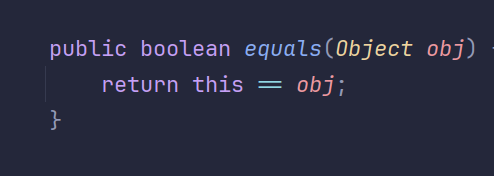
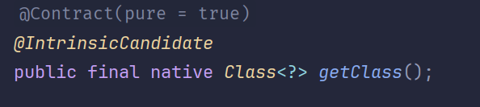
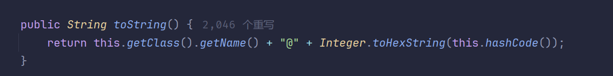
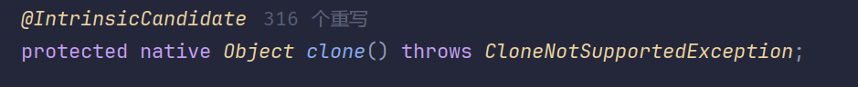

# Java 源码阅读

## Object 类

Object 类是 Java 所有类的父类

### 核心方法

#### equals

判断调用这个方法的对象是否和传入的对象相等, 即比较两个对象的引用是否相同（内存地址是否相同）

#### getClass

该方法没有具体的 java 实现，而是采用其他语言实现, 其作用是获取调用该方法的类对应的 Class 对象

#### hashCode

计算对象的 hash 值

#### toString

输出一个字符串，这个字符串包含了调用对象对应的 Class 类名词和对象 hash 值的 16 进制表示

#### clone

默认浅拷贝对象, 由于访问修饰符是 protected，所以不同包的情况下只能够在 Object 子类的作用域之中(类的花括号之中)去使用，调用 clone 方法的类还必须实现 Cloneable 接口，否则会抛出 CloneNotSupportedException 异常
