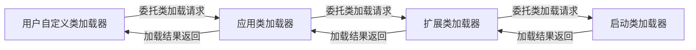

# Java 类

## 类修饰符

在 Java 中，类的修饰符主要有两种：`public` 和 默认（即不显示声明修饰符）, 类修饰符描述了类的包访问权限。

| 修饰符   | 访问范围                  | 是否可被其他包访问 | 是否可被同包类访问 |
|----------|---------------------------|-------------------|-------------------|
| public   | 当前包和所有其他包         | 是                | 是                |
| 默认 | 仅限当前包                | 否                | 是                |


## 类加载器

Java 的类加载器（ClassLoader）是 Java 虚拟机（JVM）中负责加载类文件（.class）的组件。它的主要作用是将字节码文件加载到内存，并为 JVM 提供类的定义

Java 的类加载器主要分为以下几种：

-   **启动类加载器（Bootstrap ClassLoader）**：负责加载 Java 核心类库（`JAVA_HOME/lib` 下的类），由 C++ 实现，属于 JVM 的一部分。
-   **扩展类加载器（Extension ClassLoader）**：负责加载 `JAVA_HOME/lib/ext` 目录下的类库。
-   **应用类加载器（AppClassLoader）**：负责加载应用程序的 classpath 下的类，是最常用的类加载器。
-   **自定义类加载器**：用户可以根据需要自定义类加载器，继承 `ClassLoader` 实现。

## 类加载机制

Java 的类加载机制是指 Java 虚拟机在运行时如何加载类文件的过程。这个过程包括类的加载、连接和初始化三个阶段。

1. **加载（Loading）**：

    - 通过类的全限定名获取类的二进制字节流
    - 将字节流代表的静态存储结构转换为方法区的运行时数据结构
    - 在堆中生成代表该类的 Class 对象

2. **连接（Linking）**：

    - **验证**：确保字节码文件符合 JVM 规范
    - **准备**：为类变量分配内存并设置默认初始值
    - **解析**：将符号引用转换为直接引用

3. **初始化（Initialization）**：
    - 执行类构造器 `<clinit>()` 方法（自动收集所有类变量的赋值动作和静态代码块）
    - 父类的 `<clinit>()` 方法先执行

> [!NOTE]
> 验证阶段是 JVM 安全性的重要保障，可以防止恶意代码破坏 JVM 运行环境
>
> 类加载的验证过程包括以下几个步骤：
>
> 1. **文件格式验证**：验证字节码文件是否符合 Class 文件格式规范
> 2. **元数据验证**：验证类的元数据信息是否符合 Java 语言规范
> 3. **字节码验证**：验证方法体中的字节码指令是否合法
> 4. **符号引用验证**：验证符号引用是否可以转换为直接引用

### 类加载的时机

1. **主动引用**（触发类初始化）：

    - 创建类的实例（new）
    - 访问类的静态变量（非 final）
    - 调用类的静态方法
    - 反射调用（Class.forName()）
    - 初始化子类时父类会被初始化
    - JVM 启动时指定的主类

2. **被动引用**（不会触发类初始化）：
    - 通过子类引用父类的静态字段
    - 通过数组定义引用类
    - 访问类的 final 常量

### 类加载的顺序

在 Java 中，类的加载顺序是由 JVM 在运行时动态决定的。类加载的顺序直接影响类的初始化和静态块的执行顺序。

以下是类加载的顺序，使用箭头图示说明：

```plaintext
父类静态代码块和静态变量
    ↓
子类静态代码块和静态变量
    ↓
父类实例变量和初始化块
    ↓
父类构造方法
    ↓
子类实例变量和初始化块
    ↓
子类构造方法
```

> [!TIP]
> 静态成员变量和静态代码块的初始化顺序是“谁写在前面谁先执行”

```java
class Parent {
     static {
          System.out.println("父类静态代码块");
     }

     {
          System.out.println("父类实例初始化块");
     }

     public Parent() {
          System.out.println("父类构造方法");
     }
}

class Child extends Parent {
     static {
          System.out.println("子类静态代码块");
     }

     {
          System.out.println("子类实例初始化块");
     }

     public Child() {
          System.out.println("子类构造方法");
     }
}

public class Main {
     public static void main(String[] args) {
          System.out.println("创建第一个子类对象：");
          new Child();

          System.out.println("\n创建第二个子类对象：");
          new Child();
     }
}
```

输出结果:

```text
    父类静态代码块
    子类静态代码块

    创建第一个子类对象时：

    父类实例初始化块
    父类构造方法
    子类实例初始化块
    子类构造方法

    创建第二个子类对象时：

    父类实例初始化块
    父类构造方法
    子类实例初始化块
    子类构造方法
```

> [!TIP]
> 静态代码块的执行顺序与类的加载顺序一致，而实例初始化块和构造方法的执行顺序与对象的创建顺序一致。


## 双亲委派机制

双亲委派机制（Parent Delegation Model）是 Java 类加载器（ClassLoader）的一种工作机制。它规定了类加载器在加载类时的查找顺序.

工作流程:

1. 当类加载器收到类加载请求时，首先不会自己去尝试加载，而是把请求委托给父加载器。
2. 父加载器如果还有父加载器，则继续向上委托，直到顶层的启动类加载器。
3. 从顶层加载器开始，尝试进行类加载, 如果无法加载, 再由下一级加载器尝试加载, 
4. 如果所有的类加载器都无法加载该类, 则抛出 `ClassNotFoundException` 异常, 否则返回加载的类.



> [!TIP]
> 当某个加载器成功加载类后, 会将加载结果逐级返回, 即使下级加载器也能够加载这个类, 也不会再进行类加载.

主要优点:

-   **安全性**：防止核心类库被篡改或替换。
-   **避免重复加载**：同一个类只会被加载一次，保证类的唯一性。
-   **层次清晰**：各类加载器职责分明，便于管理和扩展。

> [!NOTE]
> 某些框架（如 Tomcat、JSP/Servlet 容器、OSGi）会打破双亲委派机制，实现自己的类加载逻辑，以满足热部署、隔离等需求。
