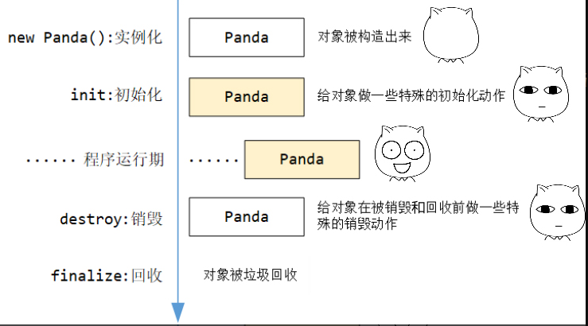

# Java 默认行为

## 字符串的加法运算

```java
public class Main {
    public static void main(String[] args) {
        Person person = new Person();
        System.out.println("hee" + person);
        System.out.println(1 + "Hee");
    }
}

// 反编译的class文件
public class Main {
    public static void main(String[] args) {
        Person person = new Person();
        // String的vlueOf(Object obj) 方法如果传入对象为null则为"null", 否则调用对象的 toString() 方法
        System.out.println("hee" + String.valueOf(person));
        System.out.println("1.0Hee");
    }
}
```
## 深拷贝和浅拷贝

在 Java 中，拷贝对象时有两种方式：**浅拷贝**和**深拷贝**。

- **浅拷贝**：只复制对象本身，对于对象中的引用类型字段，只复制引用地址, 共用同一份对象, 对于基本数据类型字段则复制其值, 各自拥有独立的值, 修改不会相互影响.
- **深拷贝**：不仅复制对象本身，还会递归复制对象中的所有引用类型字段，拷贝出的对象与原对象完全独立，互不影响。

> [!TIP]
> 无论是深拷贝还是浅拷贝都会创建一个新对象


```java
class Person implements Cloneable {
    String name;
    Address address;

    public Person(String name, Address address) {
        this.name = name;
        this.address = address;
    }

    // 浅拷贝
    @Override
    protected Object clone() throws CloneNotSupportedException {
        return super.clone();
    }

    // 深拷贝
    public Person deepClone() throws CloneNotSupportedException {
        Person cloned = (Person) super.clone();
        cloned.address = (Address) address.clone();
        return cloned;
    }
}

class Address implements Cloneable {
    String city;
    public Address(String city) { this.city = city; }
    @Override
    protected Object clone() throws CloneNotSupportedException {
        return super.clone();
    }
}
```

**对比总结**

| 特性     | 浅拷贝                       | 深拷贝                       |
| -------- | ---------------------------- | ---------------------------- |
| 基本类型 | 复制值                       | 复制值                       |
| 引用类型 | 复制引用地址（指向同一对象） | 复制新对象（完全独立）       |
| 影响     | 修改引用对象会互相影响        | 修改互不影响                 |
| 实现方式 | `Object.clone()` 默认行为     | 需手动递归拷贝引用类型字段   |

> [!TIP]
> 深拷贝常见实现方式：重写 `clone()` 方法、序列化与反序列化、第三方库（如 Apache Commons Lang）。


## 对象生命周期

Java 对象的生命周期包括以下几个阶段：
- 创建/实例化阶段：调用类的构造方法，产生一个新的对象。
- 初始化阶段：对象已创建但尚未被正式使用，可能执行一些额外操作（如预初始化数据库连接池）。
- 运行使用期：对象初始化完毕，程序正常运行，对象被使用。
- 销毁阶段：对象准备被销毁，通常已不再被使用，需要预先处理自身占用的资源（如关闭、释放数据库连接）。
- 回收阶段：对象已完全没有被引用，将在合适的时机被垃圾回收器回收。

