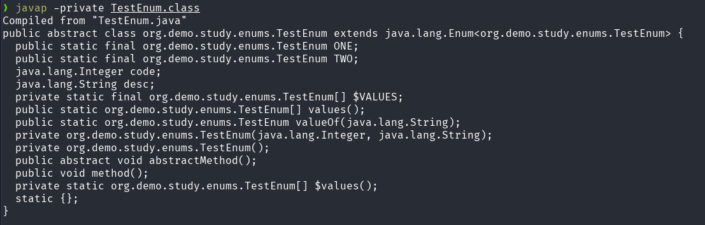

## Java 枚举

Java 枚举（`enum`）是一种特殊的类，用于定义一组常量。枚举类型在编译后会生成一个继承自 `java.lang.Enum` 的类，具有类型安全和丰富的功能。

### 定义枚举

```java
public enum TestEnum {
    ONE(1, "one") {
        @Override
        public void abstractMethod() {
            System.out.println("one");
        }

        @Override
        public void method() {
            System.out.println("one method");
        }
    },
    TWO {
        @Override
        public void abstractMethod() {
            System.out.println("two");
        }
    };

    Integer code;
    String desc;

    TestEnum(Integer code, String desc) {
        this.code = code;
        this.desc = desc;
    }

    TestEnum() {
    }

    public abstract void abstractMethod();
    public void method() {
        System.out.println("method");
    }
}

```
javap 反编译内容: 



可以看到定义的枚举类有以下特点:

1. 枚举类默认继承自 `java.lang.Enum` 类，不能再继承其他类。
2. 枚举类的构造器的访问权限是 `private`, 即使你没有显示书写`private`访问权限。
3. 枚举类的每个枚举值都是该类的一个静态实例，使用`public static final` 修饰
4. 枚举类有两个默认的`public`访问权限的静态方法 `values()` 和 `valueOf(String name)`，分别用于获取所有枚举值和根据名称获取枚举值。
5. 枚举类也能够声明抽象方法，并且每个枚举值都必须实现该抽象方法, 普通方法也可以被枚举值重写。
