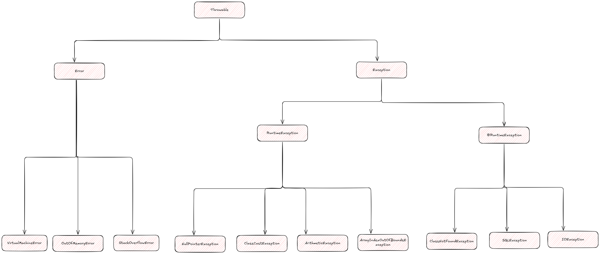

# Java 异常

异常是程序运行过程中出现的错误或意外情况。Java 通过异常机制来处理运行时错误,使程序更加健壮。

## 异常架构



根据上面的异常架构, Java中的异常可以分为两大类:
1. **Error**: 系统级错误,程序无法处理
2. **Exception**: 程序可以处理的异常
   - **受检异常(Checked Exception)**: 编译时必须处理
   - **非受检异常(Unchecked Exception)**: 运行时异常,可以不处理


## 异常处理

### try-catch-finally

```java
try {
    // 可能抛出异常的代码
    int result = 10 / 0;
} catch (ArithmeticException e) {
    // 处理算术异常
    System.out.println("除数不能为0");
} catch (Exception e) {
    // 处理其他异常
    e.printStackTrace();
} finally {
    // 无论是否发生异常都会执行
    // ...
}
```

### throw 和 throws

**throw**: 用于在方法内部抛出异常

```java
public void checkAge(int age) {
    if (age < 0) {
        throw new IllegalArgumentException("年龄不能为负数");
    }
}
```

**throws**: 用于在方法签名中声明可能抛出的异常

```java
public void readFile(String path) throws IOException {
    FileReader reader = new FileReader(path);
    // 读取文件操作
}
```

### try-with-resources

自动关闭资源, 仅适用于实现了 AutoCloseable 接口的类:

```java
try (FileReader reader = new FileReader("file.txt");
     BufferedReader br = new BufferedReader(reader)) {
    String line = br.readLine();
} catch (IOException e) {
    e.printStackTrace();
}
// 资源会自动关闭,无需finally块
```

## 自定义异常

```java
// 自定义受检异常
public class BusinessException extends Exception {
    public BusinessException(String message) {
        super(message);
    }
}

// 自定义非受检异常
public class CustomRuntimeException extends RuntimeException {
    public CustomRuntimeException(String message) {
        super(message);
    }
}
```

## 参考实践

1. **不要捕获 Throwable 或 Error**
2. **尽可能使用具体的异常类型**
3. **不要忽略异常** (避免空的catch块)
4. **在合适的层级处理异常**
5. **记录异常信息**,便于问题排查
6. **优先使用标准异常**
7. **异常信息要清晰明确**
8. **及时释放资源**,使用try-with-resources