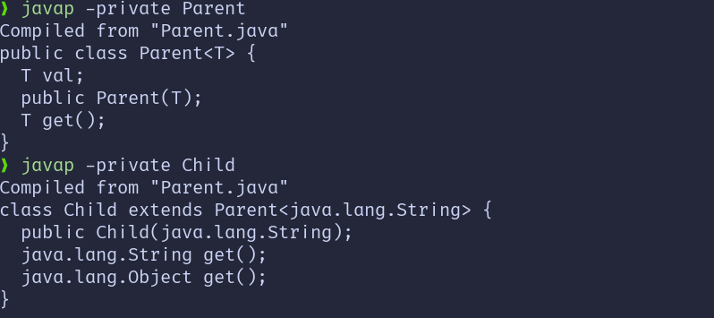

# Java 泛型

Java 泛型（Generics）是 Java 5 引入的一种特性，用于在编译时提供类型检查和消除类型转换的需要。它允许类、接口和方法操作指定类型的对象。

## 泛型类

泛型类允许在类定义时指定类型参数。

```java
// <T>表示声明一个泛型类
// <T>必须在类名后书写
public class Box<T> {
    private T item;

    public void setItem(T item) {
        this.item = item;
    }

    public T getItem() {
        return item;
    }
}

// 子类继承时需要指定泛型类的具体类型
public class StringBox extends Box<String> {
    // ...
}

// 使用泛型类
Box<String> stringBox = new Box<>();
stringBox.setItem("Hello");
```

## 泛型方法

泛型方法允许在方法定义时指定类型参数。

```java
public class Utils {
    // <T>表示声明一个泛型方法
    // <T>必须在方法返回值前书写
    public static <T> void printArray(T[] array) {
        for (T element : array) {
            System.out.println(element);
        }
    }
}

// 使用泛型方法
String[] names = {"Alice", "Bob", "Charlie"};
Utils.printArray(names);
```

> [!TIP]
> 如果方法和类都使用了泛型，且方法的泛型参数与类的泛型参数同名，方法的泛型参数会覆盖类的泛型参数。

## 通配符

通配符 `?` 用于表示未知类型，常用于泛型的上下界约束。

-   **无界通配符**：`<?>` 表示任意类型。
-   **上界通配符**：`<? extends T>` 表示 T 或 T 的子类。
-   **下界通配符**：`<? super T>` 表示 T 或 T 的父类。

```java
public void printList(List<?> list) {
    for (Object item : list) {
        System.out.println(item);
    }
}
```

## 桥接方法

桥接方法是编译器为支持泛型而自动生成的方法，用于解决类型擦除带来的多态问题。

```java
public class Parent <T> {
    T val;

    public Parent(T val) {
        this.val = val;
    }

    T get() {
        return val;
    }
}

class Child extends Parent<String> {
    public Child(String val) {
        super(val);
    }

    @Override
    String get() {
        return "child get method";
    }
}
```
javap:



从图中可以看到Child类中有两个get方法，一个是桥接方法(返回值为Object)，一个是重写的方法(返回值为String)。

> [!TIP]
> 上面的get方法违反了方法重载规则, 但是Java编译器允许这种情况, 因为桥接方法是编译器自动生成的, 并不是程序员手写的

```java
// 桥接方法
public Object get() {
    return get();
}
```

## 泛型的局限性

1. **类型擦除**：泛型在运行时会被擦除，导致类型信息不可用。
2. **不能使用基本类型**：泛型不支持基本数据类型（如 `int`），需要使用包装类（如 `Integer`）。
3. **不能创建泛型数组**：例如，`new T[10]` 是非法的。
4. **不能实例化泛型类型**：例如，`new T()` 是非法的。
5. **不能做类型推断**：`if (obj instanceof T)` 是非法的。