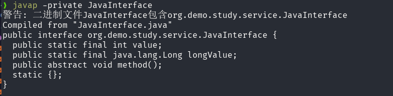

# Java 接口

## 接口定义

在 Java 中, 想要定义一个接口, 使用 `interface` 关键字. 示例如下:

```java
public interface JavaInterface {
    int value = 5;
    Long longValue = 10L;

    void method();
}
```
反编译之后的内容:



可以看到接口有以下特点:

-   接口中的字段默认是 `public static final`，即常量，不能被修改, 定义的时候必须赋值。
-   接口中的方法默认是 `public abstract`，即抽象方法, 不能有方法体, 只能被实现类重写.


## 修饰符限制

Java 接口中定义的字段和方法有严格的修饰符限制:

-   字段: `public`, `static`, `final`
-   方法: `public`, `abstract`, `default`, `static`, `private`
-   接口本身(即类修饰符): `public`, `abstract`

## 历史变动

-   Java 7 及更早版本: 只能包含抽象方法和常量。
-   Java 8: 引入了 `default` 方法和 `static` 方法, 允许在接口中定义带有方法体的默认实现.
-   Java 9: 引入了 `private` 方法, 允许在接口中定义私有方法, 这些方法只能被接口中的其他方法调用, 不能被实现类访问.
