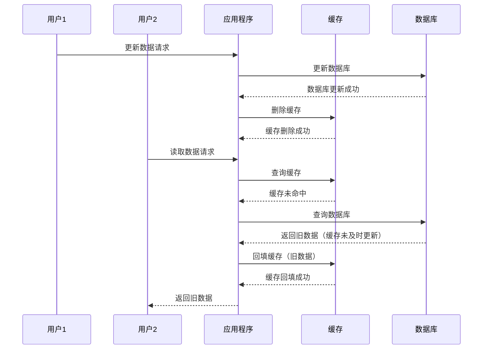
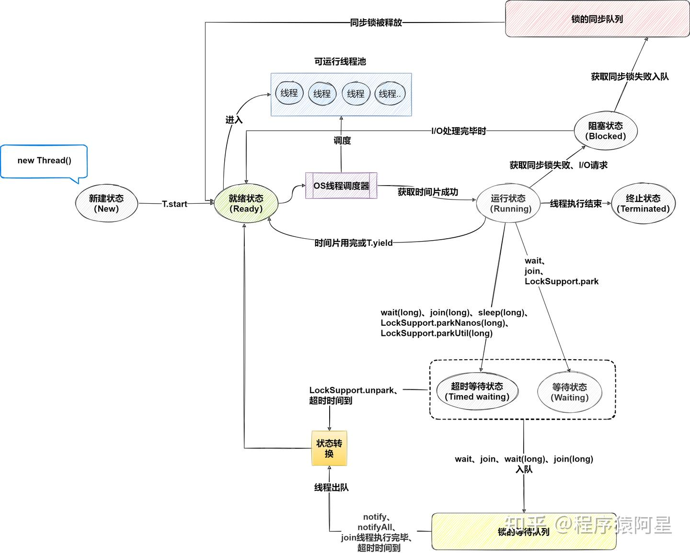
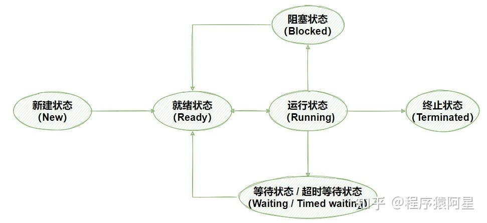

# Java 多线程

## 创建线程

在 Java 中，创建线程主要有两种方式：

1.  继承 `Thread` 类：

```java
// 1. 定义一个类，继承 Thread 类
class MyThread extends Thread {
    // 2. 重写 run() 方法，编写线程执行的任务
    @Override
    public void run() {
        // 线程要执行的任务
        System.out.println("线程正在执行：" + Thread.currentThread().getName());
    }
}

public class Main {
    public static void main(String[] args) {
        // 3. 创建线程对象
        MyThread thread1 = new MyThread();
        // 4. 启动线程
        thread1.start(); // 启动线程，执行 run() 方法

        MyThread thread2 = new MyThread();
        thread2.start();
    }
}
```

2.  实现 `Runnable` 接口：

```java
// 1. 定义一个类，实现 Runnable 接口
class MyRunnable implements Runnable {
    // 2. 实现 run() 方法，编写线程执行的任务
    @Override
    public void run() {
        // 线程要执行的任务
        System.out.println("线程正在执行：" + Thread.currentThread().getName());
    }
}

public class Main {
    public static void main(String[] args) {
        // 3. 创建 Runnable 对象
        MyRunnable runnable = new MyRunnable();
        // 4. 创建 Thread 对象，并将 Runnable 对象作为参数传递
        Thread thread1 = new Thread(runnable);
        // 5. 启动线程
        thread1.start(); // 启动线程，执行 run() 方法
        // 实际上由thread 代理执行runnable的run方法

        Thread thread2 = new Thread(runnable);
        thread2.start();
    }
}
```

> [!TIP]
> 实现 `Runnable` 接口的方式更为常用，因为它避免了 Java 单继承的限制，并且更符合面向接口编程的思想。

### 线程状态

Java 线程有以下几种状态：

| 状态              | 描述                                                             |
| ----------------- | ---------------------------------------------------------------- |
| **NEW**           | 初始状态，线程被创建但还未启动。                                 |
| **RUNNABLE**      | 可运行状态，包括 `READY`（就绪）和 `RUNNING`（运行中）两种状态。 |
| **BLOCKED**       | 阻塞状态，线程等待锁释放。                                       |
| **WAITING**       | 等待状态，线程等待其他线程的通知。                               |
| **TIMED_WAITING** | 定时等待状态，线程在指定时间内等待其他线程的通知。               |
| **TERMINATED**    | 终止状态，线程执行完毕。                                         |

### 多线程常见问题

#### 缓存与数据库双写不一致问题

在分布式系统中，缓存与数据库的双写操作可能会导致数据不一致问题。常见的场景是：当数据库更新后，缓存未及时更新或删除需要一些时间，在这段时间里查询导致读取缓存时获取到的是旧数据，造成数据不一致

> [!NOTE]
> 问题产生的原因是两个操作之间的时间间隔内，其他线程读取了旧的缓存数据或缓存被其他线程覆盖，导致数据不一致



##### 解决方案

1. **缓存延迟双删策略**：

    - 更新数据库后，立即删除缓存。
    - 等待一段时间后，再次删除缓存，确保缓存中不会存在旧数据。

2. **消息队列异步更新**：

    - 数据库更新后，发送消息到消息队列。
    - 消费者监听消息队列，异步更新缓存。

3. **读写分离策略**：
    - 写操作直接更新数据库，并删除缓存。
    - 读操作优先从缓存读取，缓存未命中时从数据库读取并回填缓存。

> [!TIP]
> 选择合适的策略需要根据业务场景权衡一致性、性能和复杂性。

## Java 线程状态模型

完整线程模型以及线程状态转如下所示：


简化图示:
