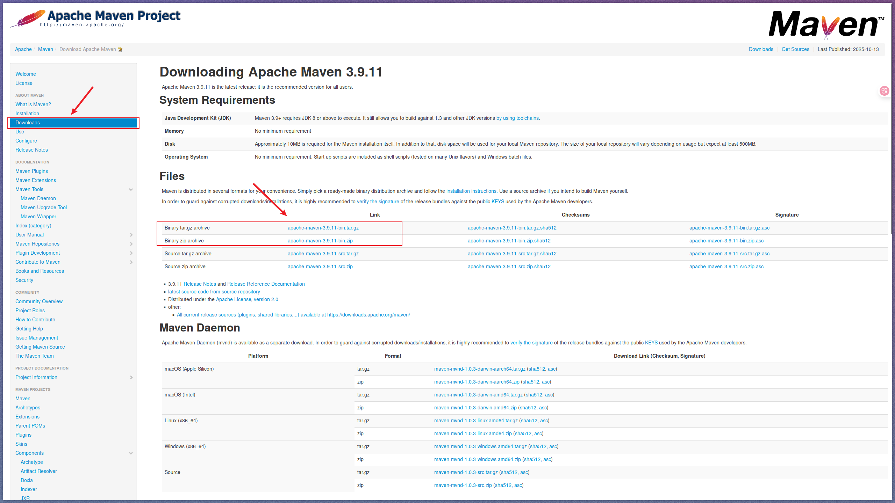
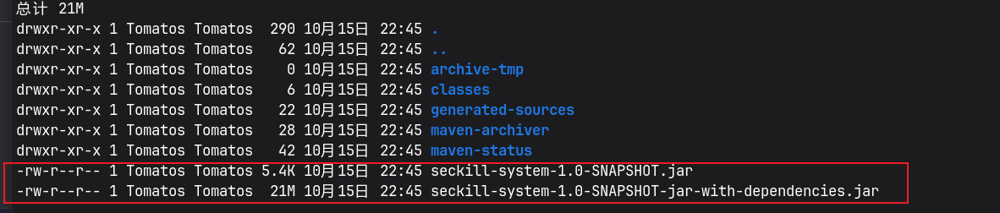

# Maven

Maven 是一个项目管理工具，可以对 Java 项目进行构建、依赖管理。Maven 也可被用于构建和管理各种项目，例如 C#，Ruby，Scala 和其他语言编写的项目

Maven可以帮助我们做：

-   项目的自动构建，包括代码的编译、测试、打包、安装、部署等操作。
-   依赖管理，项目使用到哪些依赖，可以快速完成导入。

## Maven 下载

进入[Maven 官网](https://maven.apache.org/), 按照下图进行操作:



> [!TIP]
> `Windows`选择zip格式, `Linux`选择targz格式

## Maven 基本配置

IDEA 中自带 Maven，不需要任何配置及可以使用。如果想要使用本地的 Maven 按照如下步骤进行配置：


修改完成默认位置后，还需要修改 Maven 默认配置文件`settings.xml`，指定本地仓库路径，如果不指定仍然会使用默认仓库路径


**注：**`setting.xml`位于 Maven 安装目录 conf 文件夹下

---

由于 Maven 中心仓库服务器位于国外，在国内访问速度可能会很缓慢。可以配置仓库镜像加快访问速度（配置仓库镜像后。所需要的依赖会从镜像中寻找，而不是原来的中心仓库）。添加如下的内容到配置文件的`mirrors`标签中：

```xml
<mirror>
	<id>alimaven</id>
	<mirrorOf>central</mirrorOf>
    <!-- 名称可以自定义 -->
	<name>aliyun maven</name>
	<url>http://maven.aliyun.com/nexus/content/repositories/central/</url>
</mirror>
```


## Maven 项目结构

Maven 推荐的标准项目结构如下:


## Maven 标签参考

```xml
<project xmlns="http://maven.apache.org/POM/4.0.0"
                 xmlns:xsi="http://www.w3.org/2001/XMLSchema-instance"
                 xsi:schemaLocation="http://maven.apache.org/POM/4.0.0 http://maven.apache.org/xsd/maven-4.0.0.xsd">

        <!-- 项目模型版本 -->
        <modelVersion>4.0.0</modelVersion>

        <!-- 项目分组ID，通常为公司或组织的域名倒写 -->
        <groupId>com.example</groupId>

        <!-- 项目唯一标识名 -->
        <artifactId>demo-project</artifactId>

        <!-- 项目版本号 -->
        <version>1.0.0</version>

        <!-- 打包类型（jar/war/pom等） -->
        <packaging>jar</packaging>

        <!-- 项目名称 -->
        <name>Demo Project</name>

        <!-- 项目描述 -->
        <description>这是一个包含所有常用 Maven 标签的示例项目。</description>

        <!-- 项目主页 -->
        <url>https://example.com/demo-project</url>

        <!-- 项目属性，可用于变量替换 -->
        <properties>
                <maven.compiler.source>1.8</maven.compiler.source>
                <maven.compiler.target>1.8</maven.compiler.target>
                <project.build.sourceEncoding>UTF-8</project.build.sourceEncoding>
        </properties>

        <!-- 项目依赖列表 -->
        <dependencies>
                <dependency>
                        <groupId>org.slf4j</groupId>
                        <artifactId>slf4j-api</artifactId>
                        <version>1.7.30</version>
                        <!-- 依赖作用域 -->
                        <scope>compile</scope>
                        <!-- 可选依赖声明 -->
                        <optional>false</optional>
                        <!-- 排除传递依赖 -->
                        <exclusions>
                                <exclusion>
                                        <groupId>org.slf4j</groupId>
                                        <artifactId>slf4j-log4j12</artifactId>
                                </exclusion>
                        </exclusions>
                </dependency>
        </dependencies>

        <!-- 依赖管理，统一版本控制 -->
        <dependencyManagement>
                <dependencies>
                        <dependency>
                                <groupId>junit</groupId>
                                <artifactId>junit</artifactId>
                                <version>4.13.2</version>
                                <scope>test</scope>
                        </dependency>
                </dependencies>
        </dependencyManagement>

        <!-- 构建相关配置 -->
        <build>
                <!-- 源码目录配置 -->
                <sourceDirectory>src/main/java</sourceDirectory>
                <!-- 资源文件目录配置 -->
                <resources>
                        <resource>
                                <directory>src/main/resources</directory>
                        </resource>
                </resources>
                <!-- 插件配置 -->
                <plugins>
                        <plugin>
                                <artifactId>maven-compiler-plugin</artifactId>
                                <version>3.8.1</version>
                                <configuration>
                                        <source>${maven.compiler.source}</source>
                                        <target>${maven.compiler.target}</target>
                                </configuration>
                        </plugin>
                </plugins>
        </build>

        <!-- 项目模块（多模块项目使用） -->
        <modules>
                <module>module-a</module>
                <module>module-b</module>
        </modules>

        <!-- 父项目配置（用于继承） -->
        <parent>
                <groupId>com.example.parent</groupId>
                <artifactId>parent-project</artifactId>
                <version>1.0.0</version>
        </parent>

        <!-- 项目开发者信息 -->
        <developers>
                <developer>
                        <id>dev01</id>
                        <name>开发者姓名</name>
                        <email>dev01@example.com</email>
                        <roles>
                                <role>开发</role>
                        </roles>
                </developer>
        </developers>

        <!-- 项目许可证信息 -->
        <licenses>
                <license>
                        <name>Apache License 2.0</name>
                        <url>https://www.apache.org/licenses/LICENSE-2.0</url>
                        <distribution>repo</distribution>
                </license>
        </licenses>

        <!-- SCM（源码管理）信息 -->
        <scm>
                <connection>scm:git:git://github.com/example/demo-project.git</connection>
                <developerConnection>scm:git:ssh://github.com/example/demo-project.git</developerConnection>
                <url>https://github.com/example/demo-project</url>
        </scm>

        <!-- 项目分发管理（如发布仓库） -->
        <distributionManagement>
                <repository>
                        <id>releases</id>
                        <name>Release Repository</name>
                        <url>https://repo.example.com/releases</url>
                </repository>
                <snapshotRepository>
                        <id>snapshots</id>
                        <name>Snapshot Repository</name>
                        <url>https://repo.example.com/snapshots</url>
                </snapshotRepository>
        </distributionManagement>

        <!-- 项目报告配置 -->
        <reporting>
                <outputDirectory>target/site</outputDirectory>
                <plugins>
                        <plugin>
                                <groupId>org.apache.maven.plugins</groupId>
                                <artifactId>maven-project-info-reports-plugin</artifactId>
                                <version>3.1.2</version>
                        </plugin>
                </plugins>
        </reporting>

        <!-- 项目仓库配置 -->
        <repositories>
                <repository>
                        <id>central</id>
                        <name>Maven Central</name>
                        <url>https://repo.maven.apache.org/maven2</url>
                </repository>
        </repositories>

        <!-- 插件仓库配置 -->
        <pluginRepositories>
                <pluginRepository>
                        <id>central</id>
                        <name>Maven Central Plugin Repository</name>
                        <url>https://repo.maven.apache.org/maven2</url>
                </pluginRepository>
        </pluginRepositories>

        <!-- 项目邮件列表 -->
        <mailingLists>
                <mailingList>
                        <name>开发者邮件列表</name>
                        <archive>https://example.com/mail-archive</archive>
                        <post>dev@example.com</post>
                </mailingList>
        </mailingLists>

        <!-- 项目组织信息 -->
        <organization>
                <name>Example Org</name>
                <url>https://example.com</url>
        </organization>

        <!-- 项目依赖的 profile 配置 -->
        <profiles>
                <profile>
                        <id>dev</id>
                        <activation>
                                <activeByDefault>true</activeByDefault>
                        </activation>
                        <properties>
                                <env>dev</env>
                        </properties>
                </profile>
        </profiles>
</project>
```

## Maven 依赖搜索

想要查找某个 Maven 依赖, 可以在[Maven中心仓库](https://mvnrepository.com/)进行搜索, 下面以查找lombok为例子, 讲解怎么操作及: 


单击所需版本的版本号


选择 Maven，就可以看到对应的依赖信息


## Maven 依赖查找流程

对于pom文件中声明的依赖, Maven会先从本地仓库中尝试查找, 如果依赖不存在, 则会去远程仓库中查找, 如果远程仓库中存在该依赖, 则会缓存到本地仓库中.

> [!TIP]
> 对于Windows系统, Maven本地仓库默认位置为`C:/Users/用户名/.m2/`

## Maven 依赖作用域

Maven 中使用 `scope` 属性来指定依赖的作用域范围：

| 作用域      | 编译 | 测试 | 运行 | 打包 | 传递性 |
| ----------- | ---- | ---- | ---- | ---- | ------ |
| compile     | √    | √    | √    | √    | √      |
| provided    | √    | √    | ×    | ×    | ×      |
| runtime     | ×    | √    | √    | √    | √      |
| test        | ×    | √    | ×    | ×    | ×      |
| system      | √    | √    | ×    | ×    | ×      |

> [!TIP]
> * 如果没有显示指定`scope`，则默认作用域为`compile`
> * system 的作用域和 provided 一样，但是它不是从远程仓库获取，而是直接导入本地 Jar 包
> * 传递性表示当前项目的依赖是否会被子项目继承

-   **compile** ：依赖在编译、运行、测试、打包时均有效。
-   **provided** ：依赖在编译、测试时有效，但是在运行时无效，也就是说，项目在运行时，不需要此依赖，比如我们上面的 Lombok，我们只需要在编译阶段使用它，编译完成后，实际上已经转换为对应的代码了，因此 Lombok 不需要在项目运行时也存在。
-   **runtime** ：依赖在在运行、测试、打包时有效，编译代码时无效. 例如 JDBC 驱动，我们在编译代码时仅依赖JDBC相关接口(JDK标准库已提供), 并不需要 JDBC 驱动(JDBC具体实现)，只有在运行时才需要(运行时依赖于具体的实现)，因此 JDBC 驱动的作用域可以设置为 runtime.
-   **test** ：依赖只在测试时有效，例：JUnit，我们一般只会在测试阶段使用 JUnit，而实际项目运行时，我们并不需要 JUnit，因此我们可以将 JUnit 的作用域设置为 test.
-   **system**：作用域和 provided 是一样的，但是它不是从远程仓库获取，而是直接导入本地 Jar 包

```xml
<dependency>
    <!-- 作用域为system时，groupId、artifactId、version可以自定义，但建议按照对应jar信息填写 -->
    <groupId>javax.jntm</groupId>
    <artifactId>lbwnb</artifactId>
    <version>2.0</version>
    <!-- scope为system时, 需要使用systemPath标签来指定jar文件的位置 -->
     <scope>system</scope> 
    <!-- 只有作用域为system该标签才生效 -->
     <systemPath>C:/test/A/test.jar</systemPath> 
</dependency>
```

## Maven 可选依赖

`optional`标签声明单个依赖为可选依赖. 当项目被继承时, 可选依赖不会被传递到子项目中

```xml
<dependency>
  <!-- 依赖不会传递到子项目中-->
  <groupId>org.slf4j</groupId>
  <artifactId>slf4j-api</artifactId>
  <version>1.7.30</version>
  <optional>true</optional>
</dependency>
```
> [!TIP]
> 当依赖具有传递性时(作用域声明为`compile`或`runtime`), 这个标签才会生效

## Maven 排除依赖

一个Maven依赖通常还包含多个其他的Maven依赖, 如果想要排除一些不需要的依赖, 可以使用`exclusion`标签

```xml
<dependency>
    <groupId>org.junit.jupiter</groupId>
    <artifactId>junit-jupiter</artifactId>
    <version>5.8.1</version>
    <scope>test</scope>
    <exclusions>
        <!-- exclusion需要和exclusions标签一起使用 -->
        <!-- 排除junit-jupiter中的junit-jupiter-engine依赖 -->
        <exclusion>
            <groupId>org.junit.jupiter</groupId>
            <artifactId>junit-jupiter-engine</artifactId>
        </exclusion>
    </exclusions>
</dependency>
```

## Maven 继承关系

Maven 支持多模块项目开发，多个模块可以组成一个完整的项目。每个模块可以单独编译、测试、打包、安装、部署等操作，也可以将多个模块组合成一个整体进行操作。多模块项目中有一个父项目，多个子项目，子项目可以继承父项目的配置。

子项目能够从父项目中继承以下内容：

- 父项目的依赖（`dependencies`标签中未放入`dependencyManagement`的依赖）
- 插件配置（`build/plugins`）
- 属性（`properties`）
- 资源文件（`build/resources`）
- 编译器版本等构建相关配置
- 仓库配置（`repositories`、`pluginRepositories`）
- 统一的版本号、分组ID（`groupId`、`version`）
- 继承的父项目的`distributionManagement`、`reporting`等配置
- 其他在父POM中声明且支持继承的配置项


父项目的`pom.xml`文件：

```xml
<?xml version="1.0" encoding="UTF-8"?>
<project xmlns="http://maven.apache.org/POM/4.0.0"
         xmlns:xsi="http://www.w3.org/2001/XMLSchema-instance"
         xsi:schemaLocation="http://maven.apache.org/POM/4.0.0 http://maven.apache.org/xsd/maven-4.0.0.xsd">
    <groupId>org.example</groupId>
    <artifactId>ParentModel</artifactId>
    <version>1.0-SNAPSHOT</version>
    <!-- Maven项目采用多模块时, 父模块打包方式必须声明为pom, 并在module标签中指定子模块名 -->
    <packaging>pom</packaging> 
    <modelVersion>4.0.0</modelVersion>

    <modules>
        <module>ChildModel</module>
    </modules>

    <properties>
        <maven.compiler.source>8</maven.compiler.source>
        <maven.compiler.target>8</maven.compiler.target>
    </properties>

    <dependencies>
        <dependency>
            <groupId>junit</groupId>
            <artifactId>junit</artifactId>
            <version>4.13.2</version>
            <scope>test</scope>
        </dependency>
    </dependencies>
</project>
```
子项目的`pom.xml`文件：

```xml
<?xml version="1.0" encoding="UTF-8"?>
<project xmlns="http://maven.apache.org/POM/4.0.0"
         xmlns:xsi="http://www.w3.org/2001/XMLSchema-instance"
         xsi:schemaLocation="http://maven.apache.org/POM/4.0.0 http://maven.apache.org/xsd/maven-4.0.0.xsd">
    <!-- 指定模块-->
    <parent>
        <groupId>org.example</groupId>
        <artifactId>Parent</artifactId>
        <version>1.0-SNAPSHOT</version>
    </parent>

    <modelVersion>4.0.0</modelVersion>
    <artifactId>ChildModel</artifactId>

    <!-- 子项目可以添加自己的依赖和配置 -->
    <dependencies>
        <!-- 继承父项目依赖的同时，也可以添加子项目特有的依赖 -->
        <dependency>
            <groupId>org.slf4j</groupId>
            <artifactId>slf4j-api</artifactId>
            <version>1.7.30</version>
        </dependency>
    </dependencies>
</project>
```

## Maven 常用命令

| 命令      | 说明                                                                                   |
| --------- | -------------------------------------------------------------------------------------- |
| clean     | 清理整个 `target` 文件夹，常用于解决 Spring Boot 项目缓存未更新的问题。                  |
| validate  | 验证项目的可用性。                                                                     |
| compile   | 将项目编译为 `.class` 文件。                                                           |
| package   | 根据项目配置打包生成可分发的文件（如 `.jar` 或 `.war`）。                              |
| install   | 将当前项目安装到本地仓库，供其他项目作为依赖导入使用。                                  |
| verify    | 按顺序执行每个默认生命周期阶段（如 `validate`、`compile`、`package` 等）。              |

使用示例:

```bash
# 清理项目生成的 target 目录
mvn clean

# 验证项目结构和配置是否正确
mvn validate

# 编译项目源码，生成 class 文件
mvn compile

# 打包项目，生成 jar 或 war 文件
# 这个命令生成的Jar包类型是依赖Jar, 不包含项目需要的依赖
mvn package

# 安装项目到本地仓库，供其他项目依赖
mvn install

# 执行所有生命周期阶段，确保项目完整性
mvn verify
```

## Maven 插件

### 生成可执行 Jar 包

Maven 打包命令`mvn package`生成的 Jar 包是依赖 Jar，不包含项目需要的依赖. 如果想要生成包含依赖的可执行 Jar 包, 需要使用[Maven Assembly Plugin](https://maven.apache.org/plugins/maven-assembly-plugin/)插件.

> [!TIP]
> 可执行 Jar 包含项目需要的所有依赖, 可以直接使用`java -jar xxx.jar`命令运行

```xml
<plugin>
    <!-- 不显示指定groupId, 使用默认的plugin groupId: org.apache.maven.plugins -->
    <artifactId>maven-assembly-plugin</artifactId>
    <version>[last-version]</version>
    <!-- 插件配置 -->
    <configuration>
        <!-- 指定生成jar命名后缀描述符 -->
        <descriptorRefs>
            <!-- 生成的可执行jar名称: xxxx-jar-with-dependencies.jar -->
            <descriptorRef>jar-with-dependencies</descriptorRef>
        </descriptorRefs>
        <archive>
            <manifest>
                <!-- 在清单文件中添加类路径信息，方便依赖查找 -->
                <addClasspath>true</addClasspath>
                <!-- 指定程序入口类（main 方法所在类） -->
                <mainClass>com.test.Main</mainClass>
            </manifest>
        </archive>
    </configuration>
    <!-- 指定Maven执行时, 插件执行的goal -->
    <executions>
        <execution>
            <id>make-assembly</id>
            <!-- 将插件提供的single命令绑定到package生命周期 -->
            <!-- 执行package时, 会执行插件的single命令 -->
            <phase>package</phase>
            <goals>
                <goal>single</goal>
            </goals>
        </execution>
    </executions>
</plugin>
```
插件命令已经绑定到`package`, 直接执行`package`命令会自动执行插件命令:

```bash
mvn clean package
```



第一个 Jar 包是依赖 Jar, 第二个 Jar 包是包含依赖的可执行 Jar 包

