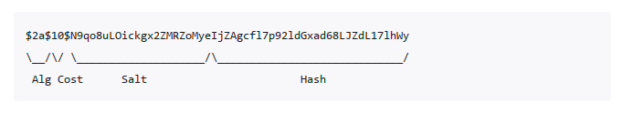

# 编程术语

## Cookie

Cookie 是一种浏览器的缓存机制，在不同的域名下存储了不同的 cookie，当发送请求的时候会将该域名下的 cookie 存储的信息一起发送到服务器之之中。下面是一张浏览器存储 Cookie 的截图：


Cookie 存储的一些元数据信息可以参考下表：

| 字段名       | 是否必须 | 示例值                          | 说明                                                         |
| ------------ | -------- | ------------------------------- | ------------------------------------------------------------ |
| `Name=Value` | ✅ 是    | `login_user=Tomatos`            | Cookie 的键值对内容，必须有，值是字符串                      |
| `Path`       | ❌ 否    | `/`                             | 表示此 Cookie 对哪个路径有效，默认为当前路径                 |
| `Domain`     | ❌ 否    | `.example.com`                  | 指定可以接收此 Cookie 的域名，默认是当前域                   |
| `Expires`    | ❌ 否    | `Wed, 01 May 2025 12:00:00 GMT` | 设置 Cookie 的过期时间（绝对时间）                           |
| `Max-Age`    | ❌ 否    | `86400`（单位：秒）             | 设置 Cookie 的有效期（相对时间），优先于 `Expires`           |
| `Secure`     | ❌ 否    | 无值（只要写上即可）            | 表示此 Cookie 只会在 HTTPS 请求中发送                        |
| `HttpOnly`   | ❌ 否    | 无值                            | 表示此 Cookie 无法被 JavaScript 访问（如 `document.cookie`） |
| `SameSite`   | ❌ 否    | `Strict` / `Lax` / `None`       | 控制跨站请求时是否携带 Cookie，用于防范 CSRF                 |

**注：**Cookie 存储在浏览器(客户端)之中

## Session

Session 是服务器为了保存用户状态而创建的一个特殊的对象

### Session 的工作流程

1. 客户端浏览器向服务端发起登录请求。
2. 登录成功后，服务端将用户信息存储在服务器端Session对象中,并生成一个唯一的 Session 标识符（由服务器决定是否唯一）。
3. 服务端将该 Session 标识符返回给客户端，通常通过 Cookie 存储在客户端浏览器中。
4. 客户端在后续请求中会携带该 Session 标识符，服务端通过标识符找到对应的会话信息。

> [!TIP]
> 每个用户对应一个 Session，会话信息存储在服务端。

### Cookie 与 Session 的对比

| 特性     | Cookie                           | Session                        |
| -------- | -------------------------------- | ------------------------------ |
| 存储位置 | 客户端浏览器                     | 服务器内存                     |
| 安全性   | 较低，可被客户端查看和修改       | 较高，存储在服务器             |
| 生命周期 | 可持久化存储                     | 默认为会话级，可配置超时时间   |
| 存储容量 | 有限（通常 4KB）                 | 较大（受服务器内存限制）       |
| 性能     | 每次请求都会传输                 | 只传输会话标识符               |
| 适用场景 | 记住用户名、主题偏好等非敏感信息 | 用户认证状态、购物车等敏感数据 |

## Token

Token 是一种身份验证机制，常用于无状态的认证场景。它通过生成一个唯一的字符串来标识用户身份，避免了在每次请求中都需要存储和验证用户的会话信息。

### Token 的工作流程

1. 用户通过用户名和密码向服务器发起登录请求。
2. 服务器验证用户信息，验证成功后生成一个 Token 并返回给客户端。
3. 客户端将 Token 存储在本地（如 LocalStorage, SessionStorage, Cookie）。
4. 客户端在后续的每次请求中将 Token 放入请求头中（通常是 `Authorization` 字段）。
5. 服务器通过解析 Token 验证用户身份并返回相应的资源。

### Token 的特点

-   **无状态**：服务器不需要存储用户的会话信息，减少了服务器的内存开销。
-   **跨平台**：Token 可以在不同的客户端（如 Web、移动端）之间通用。
-   **安全性**：通过加密算法生成，难以伪造，但需要注意 Token 的存储和传输安全。

### 常见的 Token 类型

-   **JWT（JSON Web Token）**：一种常见的 Token 格式，由三部分组成：Header、Payload 和 Signature。它是自包含的，包含了用户的基本信息和签名。
-   **OAuth Token**：用于授权的 Token，常用于第三方应用访问用户资源。

### Token 与 Session 的对比

| 特性     | Token                  | Session                  |
| -------- | ---------------------- | ------------------------ |
| 存储位置 | 客户端                 | 服务器内存               |
| 状态     | 无状态                 | 有状态                   |
| 安全性   | 依赖加密和传输安全     | 较高，存储在服务器       |
| 生命周期 | 通常有过期时间         | 会话级，可配置超时时间   |
| 适用场景 | 分布式系统、跨平台认证 | 单一服务器的用户会话管理 |

**注：**Token 的存储需要注意安全性，避免被恶意获取。

### Token 存储位置优劣对比

#### 存储在Session
**缺点**
- 无法防范XSS攻击
#### 存储在LocalStorage 
**缺点**
- 无法防范XSS攻击
#### 存储在Cookie
**优点**
- 可以防范XSS攻击（通过设置 HttpOnly 属性）
- 可以防范 CSRF 攻击（通过设置 SameSite 属性）


## CSRF

跨站请求伪造（Cross-Site Request Forgery）

一个经典的 CSRF 例子如下:
1. 用户先在站点 A（受信任站点）登录，服务器通过 Cookie／Session 保持用户已认证状态。  
2. 攻击者在自己控制的站点 B 中，构造一个指向站点 A 的请求（如 POST 转账、修改资料、删除数据等），并诱导用户访问站点 B。  
3. 用户访问站点 B 时，浏览器会自动携带对站点 A 的 Cookie，导致站点 A 误以为是用户本人发起了合法请求，从而执行请求中的敏感操作。

## Same-Origin Policy
Same-Origin Policy 即浏览器同源策略, 该策略决定了**跨域页面无法读取另一个域名下的 Cookie**

## XSS

XSS（跨站脚本攻击，Cross-Site Scripting）是一种常见的 Web 安全漏洞，攻击者通过在网页中注入恶意脚本代码，使这些代码在其他用户的浏览器中执行。XSS 攻击通常利用网站对用户输入内容缺乏有效过滤，将恶意 JavaScript 代码插入到页面中。

### XSS 的危害

- 窃取用户的 Cookie、Session 等敏感信息，导致账号被盗。
- 伪造页面内容，诱导用户进行钓鱼操作。
- 执行任意操作，如冒充用户发起请求、篡改页面数据等。
- 传播蠕虫病毒，进一步攻击其他用户。

### 如何防范 XSS

- 对用户输入进行严格的过滤和转义，尤其是在将数据输出到 HTML 页面时。
- 启用浏览器的HTTPOnly 属性，防止 JavaScript 读取 Cookie。
- 启用内容安全策略（CSP），限制页面可执行的脚本来源。
- 避免在页面中直接拼接和输出用户输入的数据。
- 定期对网站进行安全检测，修复潜在的 XSS 漏洞。

## Cross-Origin Request
跨域请求（Cross-Origin Request）是指浏览器中的 JavaScript 代码发起的请求 URL 与当前页面 URL 的**源**（Origin）不同。

当以下任一条件不同时，浏览器认为这是一个跨域请求：

-   协议（Protocol）：如 HTTP 与 HTTPS
-   域名 or 主机（Domain or Host）：如 example.com 与 api.example.com
-   端口（Port）：如 example.com:80 与 example.com:8080

### 解决跨域问题的方法

#### 添加反向代理服务器

在开发环境中，可以通过配置反向代理来解决跨域问题。反向代理服务器会将请求转发到目标服务器，从而避免浏览器的同源策略限制。

下面是一个Nginx的示例:
1. 将静态资源放在 Nginx 的静态资源目录下。
2. 浏览器访问反向代理服务器配置的地址, 如 `http://localhost:3000/api`(如果存在凭证,此时会携带)
3. Nginx 将请求转发到目标服务器，如 `http://localhost:8080/api`

## 多线程
### 并发
并行指系统在同一时间段内能够**同时交替行多个任务**。强调的任务的“交替进行”

### 并行
并行指系统在同一时刻能够**同时执行多个任务**。强调的任务的“同时进行”，通常依赖于多核或多处理器硬件.

### 乐观锁
乐观锁是一种多线程同步机制，允许多个线程并发访问共享资源，但在**更新资源**时会进行冲突检测。

### 悲观锁
悲观锁是一种多线程同步机制，假设会发生冲突，因此在访问共享资源时会先获取锁，确保只有一个线程可以访问到资源, 其他线程需要等待。 

### 公平锁
公平锁是一种多线程同步机制，确保线程按照请求锁的顺序获取锁.

> [!TIP]
> 公平锁会造成一定的性能开销

### 非公平锁
非公平锁是一种多线程同步机制，允许线程在请求锁时不按照顺序获取锁，这可能导致某些线程长时间等待。

> [!TIP]
> 如果没有顺序要求,使用非公平锁可以提高性能

### 独占锁和共享锁
根据锁只能被单个线程持有还是能被多个线程共同持有，锁可以分为独占锁和共享锁

> [!TiP]
> 独占锁是也是一种悲观锁, 而共享锁是也是一种乐观锁

### 可重入锁 
可重入锁（Reentrant Lock）是一种允许同一线程多次获取同一把锁的锁机制。它可以避免死锁问题，因为同一线程在持有锁的情况下可以再次获取该锁而不会被阻塞。

### 自旋锁
当一个线程尝试获取锁时，如果锁已经被其他线程占用，它不会进入阻塞状态，而是通过循环（自旋）不断地检查锁是否可用。只有当锁被释放后，线程才会获得锁并继续执行。

> [!TIP]
> 自旋锁使用 CPU 时间换 取线程阻塞与调度的开销，但是很有可能这些 CPU 时间白白浪费

> [!TIP]
> 自旋锁适用于锁持有时间很短、线程切换开销较大的场景，可以减少线程上下文切换带来的性能损耗。但如果锁竞争激烈或持有时间较长，自旋会浪费大量 CPU 资源。

> [!NOTE]
> 常见的自旋锁实现有 `CAS`（Compare And Swap）等原子操作。

### CAS
CAS（Compare And Swap）是一种常用的原子操作机制，广泛应用于多线程编程中。它通过比较内存中的某个值是否等于预期值，如果相等则将其更新为新值，否则不做任何操作。CAS 操作通常由硬件(CPU)指令支持，能够保证在多线程环境下的并发安全。

工作原理

1. 读取变量的当前值（旧值）。
2. 比较当前值与预期值是否相等。
3. 如果相等，则将变量更新为新值；否则不做任何操作。

CAS 操作是原子的，不会被其他线程中断，因此可以实现无锁并发。

**优点：**
- 无需加锁，性能高，避免了线程阻塞和上下文切换。
- 适用于高并发场景。

**缺点：**
- 可能出现 ABA 问题（即变量值从 A 变为 B 又变回 A，CAS 认为没有变化）。
- 循环重试可能导致性能下降。

> [!NOTE]
> Java 中`Unsafe类`, `VarHandle类(JDK 9+)`提供了CAS 操作的支持，如 `compareAndSwapInt`、`compareAndSwapObject` 等方法。


### 弱一致性
弱一致性（Weak Consistency）指的是系统**不保证每次读操作都能获得最新写入的数据**.
也就是说，写操作完成后，其他节点或线程可能在一段时间内还看不到最新的数据

### 强一致性
强一致性（Strong Consistency）指的是系统在**每次写操作完成后，所有后续的读操作都能立即读取到最新写入的数据。**
也就是说，系统中的所有节点、线程或副本在任何时刻都能看到同样的数据状态，**不会出现读到旧数据或不同步数据的情况**。


## SQL
SQL（Structured Query Language）是一种用于管理关系型数据库的标准查询语言。

### DDL
DDL（Data Definition Language） 数据定义语言，用于定义数据库结构和模式。

### DML
DML（Data Manipulation Language） 数据操作语言，用于对数据库中的数据进行查询

### DQL
DQL（Data Query Language） 数据查询语言，用于从数据库中检索数据。

### DCL
DCL（Data Control Language） 数据控制语言，用于控制对数据库的访问权限。

### TCL
TCL（Transaction Control Language） 事务控制语言，用于管理数据库事务。

## Hash 算法

### Bcrypt
bcrypt 是一种基于 Blowfish 加密算法的哈希函数，常用于密码存储。它通过引入“加盐”（salt）和可配置的计算成本（cost factor），有效防止彩虹表攻击和暴力破解。

**特点：**
- 每次加密都会生成不同的哈希值（即使明文相同），因为每次都会生成新的 salt。
- 计算成本可调，随着硬件性能提升可以增加 cost，提升破解难度。
- 广泛应用于 Web 应用的用户密码安全存储。

**流程:**

用户注册：明文密码 + 随机 salt → 哈希 → 存储（哈希值包含 salt） \
用户登录：输入密码 + 提取的 salt → 哈希 → 比较哈希值

> [!TIP]
> 使用的salt和cost factor相同, 得到的hash必然相同

**结构:**



> [!TIP]
> bcrypt 适合存储用户密码，不适合用于加密大量数据。

## Spring
### IOC
对象的创建不再由自己手动创建, 而是从容器之中获取. 这种将控制权交给别人的思想就是所谓的控制反转(Inverse of Control，IOC)
### DL
依赖查找(Dependency Lookup), 根据指定的对象名称或对象的所属类型，主动从IOC容器中获取对应的具体对象
### DI


## SSH

SSH (Secure Shell) 是一种网络协议，用于在不安全的网络中安全地访问远程计算机。它通过加密技术确保通信的机密性和完整性。

### 工作流程
这里仅介绍最常见的基于公钥和私钥的 SSH 连接流程：


### 身份验证方式

SSH 通常使用以下方式进行身份验证：

1. **公钥和私钥**: 通过生成密钥对，确保只有拥有私钥的用户可以访问。
2. **用户名和密码**: 提供传统的验证方式，但安全性较低。

SSH 是管理远程服务器和保护网络通信的关键工具，广泛应用于开发、运维和网络管理领域。

### 公钥和私钥

公钥和私钥是非对称加密中的一对密钥，用于确保数据的安全性和完整性

1. **公钥**: 可以公开分发的密钥，用于加密数据或验证数字签名。
2. **私钥**: 必须保密的密钥，用于解密数据或生成数字签名。

常见用途:
1. 私钥对需要发送的消息进行数字签名, 公钥对签名进行验证, 能够确保消息的完整性和真实性, 但不保证消息不被窃听
2. 公钥对消息进行加密, 私钥对加密的消息进行解密, 能够确保消息的机密性, 但不保证消息的完整性和和真实性(因为公钥是公开的)

安全通信流程如下：
1. **发送方用接收方公钥加密消息**（保证只有接收方能解密，防窃取）。
2. **发送方用自己的私钥对消息签名**（保证消息确实来自发送方，防篡改）。
3. **接收方收到消息后：**
   - 用自己的私钥解密（获得明文）。
   - 用发送方公钥验证签名（确认来源和完整性）。

## HTTP

HTTP（HyperText Transfer Protocol，超文本传输协议）是用于从 Web 服务器传输超文本（如 HTML、CSS、JS、图片等）到客户端（如浏览器）的 应用层协议

### 基本特点

**无状态（Stateless）**: 

每个 HTTP 请求都是独立的，服务器不会记住之前的请求（需借助 Cookie/Session机制维持状态）。

**基于请求-响应模型（Request-Response）**: 

客户端发送请求，服务器返回响应。

**可扩展性强**: 

支持自定义头部（Headers）和多种数据格式（JSON、XML 等）。

> [!NOTE]
> 默认端口
>
> HTTP：80, HTTPS：443

### 请求方法

| 方法   | 名称         | 作用描述                                   | 是否有请求体 | 是否有响应体 | 常见用途                   |
| ------ | ------------ | ------------------------------------------ | ------------ | ------------ | -------------------------- |
| GET    | 获取资源     | 从服务器获取数据或资源                     | 否           | 是           | 获取网页、API数据           |
| POST   | 创建资源     | 向服务器提交数据，通常用于创建新资源       | 是           | 是           | 表单提交、用户注册、登录    |
| PUT    | 更新资源     | 用于更新服务器上的资源（整体替换）         | 是           | 是           | 更新用户信息、修改数据      |
| PATCH  | 局部更新资源 | 用于对服务器资源进行部分修改               | 是           | 是           | 局部更新，如修改部分字段    |
| DELETE | 删除资源     | 请求服务器删除指定资源                     | 否/是        | 是           | 删除用户、移除数据          |
| HEAD   | 获取头部信息 | 类似 GET，但只返回响应头，不返回响应体     | 否           | 否           | 检查资源是否存在、获取元数据|
| OPTIONS| 查询支持方法 | 查询服务器支持哪些 HTTP 方法               | 否           | 是           | 跨域预检、API能力查询       |
| TRACE  | 跟踪请求     | 回显收到的请求，主要用于诊断和调试         | 否           | 是           | 网络调试、诊断              |
| CONNECT| 建立隧道     | 用于代理服务器建立 TCP 隧道（如 HTTPS）    | 否           | 是           | HTTPS 代理、VPN连接         |

### 请求结构

HTTP 请求是客户端（如浏览器、Postman、curl）向服务器发送数据的格式。其结构主要包括三部分：Reuest Line、Headers 和 Body(可选)。

```http
# Request Line = 请求方法 + 请求路径 + HTTP版本
POST /api/login HTTP/1.1   
# Headers
Host: www.example.com
User-Agent: Mozilla/5.0 (Windows NT 10.0; Win64; x64)
Accept: application/json
Content-Type: application/json
Content-Length: 49
Connection: keep-alive
# Body(可选)
{
  "username": "alice",
  "password": "secret123"
}

```
> [!TIP]
> 请求头和请求体之间使用空行分隔

### 响应结构

HTTP 响应是服务器返回给客户端的数据格式。其结构主要包括三部分：Status Line、Headers 和 Body(可选)。

```http
# Status Line = HTTP版本 + 状态码 + 状态描述
HTTP/1.1 200 OK
# Headers
Date: Tue, 09 Jul 2024 12:00:00 GMT
Server: Apache/2.4.41 (Ubuntu)
Content-Type: text/html; charset=UTF-8
Content-Length: 70
Connection: close
# Body(可选)
<html>
  <head><title>Example</title></head>
  <body>Hello, world!</body>
</html>

```

### 状态码表

| 状态码 | 名称                  | 描述                                       | 示例场景                                         |
| ------ | --------------------- | ------------------------------------------ | ------------------------------------------------ |
| 100    | Continue              | 服务器已收到请求头，客户端应继续发送请求体 | 上传大文件时，服务器确认可以接收数据继续传输     |
| 101    | Switching Protocols   | 服务器根据客户端的请求切换协议             | 从 HTTP 升级到 WebSocket 连接时                  |
| 200    | OK                    | 请求成功                                   | 成功获取网页、API 成功返回数据                   |
| 201    | Created               | 请求已完成，新资源已创建                   | 成功提交表单创建新用户、POST 请求创建新资源      |
| 204    | No Content            | 服务器成功处理请求，但没有返回任何内容      | 删除操作成功、保存设置成功但不需要刷新页面        |
| 301    | Moved Permanently     | 请求的资源已永久移动到新位置               | 网站域名更改、URL 结构永久调整                   |
| 302    | Found                 | 请求的资源临时从不同 URI 响应请求          | 临时重定向到登录页、支付完成后重定向回商店        |
| 304    | Not Modified          | 资源未修改，可使用缓存版本                 | 浏览器请求页面时使用 If-Modified-Since 获取缓存资源 |
| 400    | Bad Request           | 服务器无法理解请求的格式                   | 提交的 JSON 格式错误、URL 参数格式不正确         |
| 401    | Unauthorized          | 请求未授权                                 | 访问需要登录的 API、token 过期                   |
| 403    | Forbidden             | 服务器拒绝请求                             | 用户无权访问特定资源、IP 被封禁                  |
| 404    | Not Found             | 请求的资源不存在                           | 访问已删除的页面、API 端点错误                   |
| 405    | Method Not Allowed    | 请求方法不允许                             | 对只读资源使用 POST 方法、对只能 POST 的接口使用 GET |
| 429    | Too Many Requests     | 客户端发送了太多请求                       | API 限流保护、爬虫访问频率过高                   |
| 500    | Internal Server Error | 服务器内部错误                             | 服务器代码异常、数据库连接失败                   |
| 502    | Bad Gateway           | 服务器作为网关时收到了无效响应             | 负载均衡器无法连接到后端服务、上游服务返回错误   |
| 503    | Service Unavailable   | 服务器暂时不可用                           | 服务器维护中、系统过载                           |
| 504    | Gateway Timeout       | 作为网关的服务器请求超时                   | 代理服务器等待后端服务响应超时                   |
