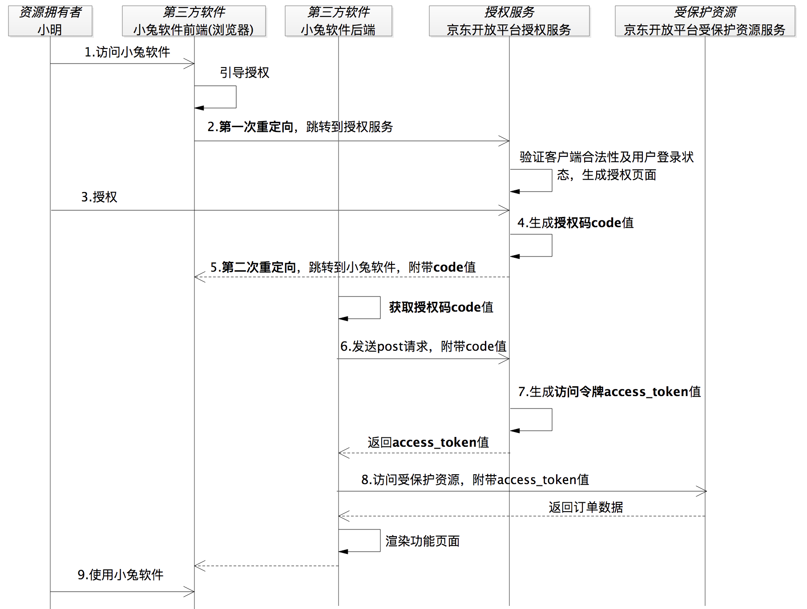

# 安全专题
## 通信安全
### 非对称加密
非对称加密是一种加密技术，使用一对密钥：公钥和私钥。公钥可以公开分发，而私钥则保密。数据使用**公钥加密后**，只有**持有私钥的人才能解密**。非对称加密常用于安全通信和数字签名。

> **数字签名为什么能够保证身份的可靠性和信息的完整性?**\
> 因为数字签名由数据摘要利用秘钥加密得来, 摘要采用了哈希算法(哈希算法是单向的, 不能够从Hash序列中逆推出原信息)保证了原信息的摘要不能够被破解.接收方使用发送方的公钥解密数字签名(无法解密说明被篡改)，得到摘要，然后对接收到的数据进行哈希运算得到一个新的摘要, 比较这两个摘要。如果一致，说明数据没有被篡改，且发送方的身份可靠。

> [!NOTE]
> 数据摘要 = 对数据进行哈希运算得到固定长度的序列 \
> 数字签名 = 私钥加密摘要 

> [!TIP]
> 私钥可用于生成数字签名，和解密公钥加密的数据. \
> 公钥可用于验证数字签名，和加密数据.

> [!NOTE]
> 如果只需要保证数据的机密性，可以使用公钥加密数据, 然后发送给私钥持有者, 这种方式不保证身份可靠性和信息完整性\
> 如果需要保证数据的完整性和身份验证，可以使用私钥对摘要进行加密得到数字签名

## 授权方式
### OAuth2.0
OAuth是Open Authorization的简写。 OAuth协议为用户资源的授权提供了一个安全的、开放而又简易的标准。与以往的授权方式不同之处是OAuth的授权不会使第三方触及到用户的帐号信息（如用户名与密码），即第三方无需使用用户的用户名与 密码就可以申请获得该用户资源的授权，因此OAuth是安全的
#### 授权方式

##### 授权码模式
流程: 

适用场景: 
授权码模式是OAuth2中最安全最完善的一种模式，应用场景最广泛，可以实现服务之间的调用，常见的微信，QQ等第三方登录也可采用这种方式实现。

> **为什么要使用授权码, 而不是直接返回Access Token给客户端后台服务器?** \
> 答: 在第三方应用授权成功后, 需要跳转回到客户端的前端(利用请求时提供的回调地址), 如果此时第三方应用授权服务器提供的Access Token直接返回到客户端后台服务器, 授权之后用户就会一直卡在授权页面, 无法返回客户端. 所以需要对用户进行二次重定向让用户回到客户端前端, 并且不能够暴露敏感信息在前端, 使用授权码能够很好的解决这个问题

> [!NOTE]
> 授权码即使泄露也不会有安全问题, 因为授权码是一次性的, 只能使用一次, 且授权码的有效期很短(通常为几分钟), 过期后就无法使用了. 另外, 第三方授权服务器会预先配置好能够授权的回调地址(客户端服务地址), 如果授权码被恶意使用, 也会因为回调地址不匹配而无法获取Access Token

##### 简化模式
对授权模式的简化，不使用授权码, 而是直接返回Access Token给客户端前端。

适用场景: 
适用于没有服务器但客户端安全的情况。比如：纯手机小程序，JavaScript语言实现的网页插件等。

##### 密码模式
流程:
+ 第一步：直接告诉【A服务客户端】自己的【B服务认证服务】的用户名和密码 
+ 第二步：【A服务客户端】携带【B服务认证服务】的用户名和密码向【B服务认证服务】发起请求获取token。 
+ 第三步：【B服务认证服务】给【A服务客户端】颁发token。 

适用场景: 
此种模式虽然简单，但用户将B服务的用户名和密码暴露给A服务，需要两个服务信任度很高才能使用。 

##### 客户端模式
流程:
+ 第一步：A服务向B服务索取token。 
+ 第二步：B服务返回token给A服务。 

适用场景:
A服务本身需要B服务资源，与用户无关。