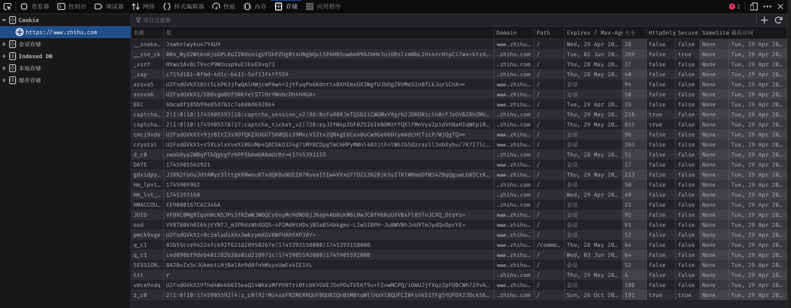

# Web 术语

## Cookie

Cookie 是一种浏览器的缓存机制，在不同的域名下存储了不同的 cookie，当发送请求的时候会将该域名下的 cookie 存储的信息一起发送到服务器之之中。下面是一张浏览器存储 Cookie 的截图：

Cookie 存储的一些元数据信息可以参考下表：

| 字段名       | 是否必须 | 示例值                          | 说明                                                         |
| ------------ | -------- | ------------------------------- | ------------------------------------------------------------ |
| `Name=Value` | ✅ 是    | `login_user=Tomatos`            | Cookie 的键值对内容，必须有，值是字符串                      |
| `Path`       | ❌ 否    | `/`                             | 表示此 Cookie 对哪个路径有效，默认为当前路径                 |
| `Domain`     | ❌ 否    | `.example.com`                  | 指定可以接收此 Cookie 的域名，默认是当前域                   |
| `Expires`    | ❌ 否    | `Wed, 01 May 2025 12:00:00 GMT` | 设置 Cookie 的过期时间（绝对时间）                           |
| `Max-Age`    | ❌ 否    | `86400`（单位：秒）             | 设置 Cookie 的有效期（相对时间），优先于 `Expires`           |
| `Secure`     | ❌ 否    | 无值（只要写上即可）            | 表示此 Cookie 只会在 HTTPS 请求中发送                        |
| `HttpOnly`   | ❌ 否    | 无值                            | 表示此 Cookie 无法被 JavaScript 访问（如 `document.cookie`） |
| `SameSite`   | ❌ 否    | `Strict` / `Lax` / `None`       | 控制跨站请求时是否携带 Cookie，用于防范 CSRF                 |

**注：**Cookie 存储在浏览器(客户端)之中

## Session

Session 是服务器为了保存用户状态而创建的一个特殊的对象

### Session 的工作流程

1. 客户端浏览器向服务端发起登录请求。
2. 登录成功后，服务端将用户信息存储在服务器端Session对象中,并生成一个唯一的 Session 标识符（由服务器决定是否唯一）。
3. 服务端将该 Session 标识符返回给客户端，通常通过 Cookie 存储在客户端浏览器中。
4. 客户端在后续请求中会携带该 Session 标识符，服务端通过标识符找到对应的会话信息。

> [!TIP]
> 每个用户对应一个 Session，会话信息存储在服务端。

### Cookie 与 Session 的对比

| 特性     | Cookie                           | Session                        |
| -------- | -------------------------------- | ------------------------------ |
| 存储位置 | 客户端浏览器                     | 服务器内存                     |
| 安全性   | 较低，可被客户端查看和修改       | 较高，存储在服务器             |
| 生命周期 | 可持久化存储                     | 默认为会话级，可配置超时时间   |
| 存储容量 | 有限（通常 4KB）                 | 较大（受服务器内存限制）       |
| 性能     | 每次请求都会传输                 | 只传输会话标识符               |
| 适用场景 | 记住用户名、主题偏好等非敏感信息 | 用户认证状态、购物车等敏感数据 |

## Token

Token 是一种身份验证机制，常用于无状态的认证场景。它通过生成一个唯一的字符串来标识用户身份，避免了在每次请求中都需要存储和验证用户的会话信息。

### Token 的工作流程

1. 用户通过用户名和密码向服务器发起登录请求。
2. 服务器验证用户信息，验证成功后生成一个 Token 并返回给客户端。
3. 客户端将 Token 存储在本地（如 LocalStorage, SessionStorage, Cookie）。
4. 客户端在后续的每次请求中将 Token 放入请求头中（通常是 `Authorization` 字段）。
5. 服务器通过解析 Token 验证用户身份并返回相应的资源。

### Token 的特点

-   **无状态**：服务器不需要存储用户的会话信息，减少了服务器的内存开销。
-   **跨平台**：Token 可以在不同的客户端（如 Web、移动端）之间通用。
-   **安全性**：通过加密算法生成，难以伪造，但需要注意 Token 的存储和传输安全。

### 常见的 Token 类型

-   **JWT（JSON Web Token）**：一种常见的 Token 格式，由三部分组成：Header、Payload 和 Signature。它是自包含的，包含了用户的基本信息和签名。
-   **OAuth Token**：用于授权的 Token，常用于第三方应用访问用户资源。

### Token 与 Session 的对比

| 特性     | Token                  | Session                  |
| -------- | ---------------------- | ------------------------ |
| 存储位置 | 客户端                 | 服务器内存               |
| 状态     | 无状态                 | 有状态                   |
| 安全性   | 依赖加密和传输安全     | 较高，存储在服务器       |
| 生命周期 | 通常有过期时间         | 会话级，可配置超时时间   |
| 适用场景 | 分布式系统、跨平台认证 | 单一服务器的用户会话管理 |

**注：**Token 的存储需要注意安全性，避免被恶意获取。

### Token 存储位置优劣对比

#### 存储在Session
**缺点**
- 无法防范XSS攻击
#### 存储在LocalStorage 
**缺点**
- 无法防范XSS攻击
#### 存储在Cookie
**优点**
- 可以防范XSS攻击（通过设置 HttpOnly 属性）
- 可以防范 CSRF 攻击（通过设置 SameSite 属性）

## CSRF

跨站请求伪造（Cross-Site Request Forgery）

一个经典的 CSRF 例子如下:
1. 用户先在站点 A（受信任站点）登录，服务器通过 Cookie／Session 保持用户已认证状态。  
2. 攻击者在自己控制的站点 B 中，构造一个指向站点 A 的请求（如 POST 转账、修改资料、删除数据等），并诱导用户访问站点 B。  
3. 用户访问站点 B 时，浏览器会自动携带对站点 A 的 Cookie，导致站点 A 误以为是用户本人发起了合法请求，从而执行请求中的敏感操作。

## Same-Origin Policy
Same-Origin Policy 即浏览器同源策略, 该策略决定了**跨域页面无法读取另一个域名下的 Cookie**

## XSS

XSS（跨站脚本攻击，Cross-Site Scripting）是一种常见的 Web 安全漏洞，攻击者通过在网页中注入恶意脚本代码，使这些代码在其他用户的浏览器中执行。XSS 攻击通常利用网站对用户输入内容缺乏有效过滤，将恶意 JavaScript 代码插入到页面中。

### XSS 的危害

- 窃取用户的 Cookie、Session 等敏感信息，导致账号被盗。
- 伪造页面内容，诱导用户进行钓鱼操作。
- 执行任意操作，如冒充用户发起请求、篡改页面数据等。
- 传播蠕虫病毒，进一步攻击其他用户。

### 如何防范 XSS

- 对用户输入进行严格的过滤和转义，尤其是在将数据输出到 HTML 页面时。
- 启用浏览器的HTTPOnly 属性，防止 JavaScript 读取 Cookie。
- 启用内容安全策略（CSP），限制页面可执行的脚本来源。
- 避免在页面中直接拼接和输出用户输入的数据。
- 定期对网站进行安全检测，修复潜在的 XSS 漏洞。

## Cross-Origin Request
跨域请求（Cross-Origin Request）是指浏览器中的 JavaScript 代码发起的请求 URL 与当前页面 URL 的**源**（Origin）不同。

当以下任一条件不同时，浏览器认为这是一个跨域请求：

-   协议（Protocol）：如 HTTP 与 HTTPS
-   域名 or 主机（Domain or Host）：如 example.com 与 api.example.com
-   端口（Port）：如 example.com:80 与 example.com:8080

### 解决跨域问题的方法

#### 添加反向代理服务器

在开发环境中，可以通过配置反向代理来解决跨域问题。反向代理服务器会将请求转发到目标服务器，从而避免浏览器的同源策略限制。

下面是一个Nginx的示例:
1. 将静态资源放在 Nginx 的静态资源目录下。
2. 浏览器访问反向代理服务器配置的地址, 如 `http://localhost:3000/api`(如果存在凭证,此时会携带)
3. Nginx 将请求转发到目标服务器，如 `http://localhost:8080/api`